## Part 1. Установка ОС

- Установка Ubuntu 20.04 Server LTS без графического интерфейса.
- Вывод команды: `cat /etc/issue`:

    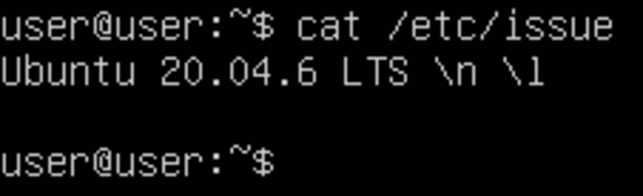

## Part 2. Создание пользователя

- Создание пользователя, отличного от созданного при установке. 
- Пользователь должен быть добавлен в группу adm.
- Создание группы: `sudo groupadd adm`
- Создание пользователя и добавление в группу adm: `sudo useradd -g adm adm`:

  

- Вывод команды: `cat /etc/passwd`:

  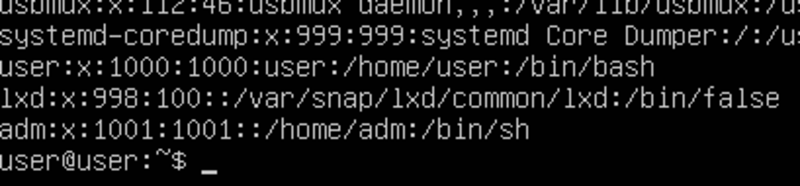

## Part 3. Настройка сети ОС

- Название машины вида user-1.
- Для установки на постоянной основе: `sudo hostnamectl set-hostname user-1`: 

  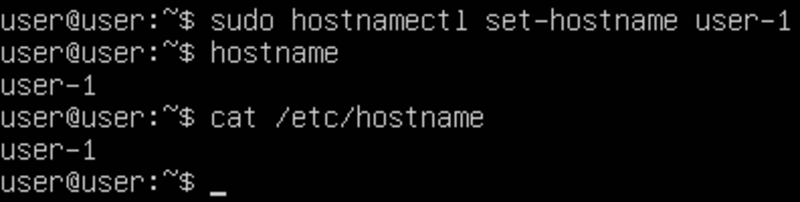

- Установка временной зоны, соответствующая текущему местоположению.
- Для установки временной зоны: `sudo datetimectl set-timezone Europe/Moscow`

  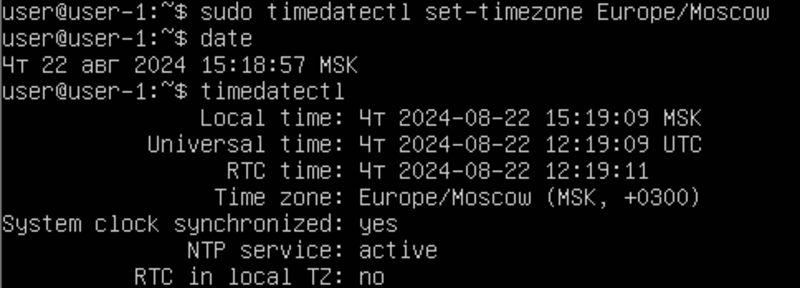

- Вывод названия сетевых интерфейсов с помощью консольной команды: `ip l`
  
  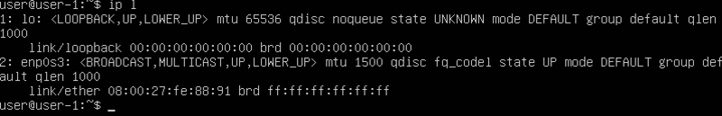

- >Интерфейс lo - это интерфейс обратной петли, имеющей IP-адрес 127.0.0.1, который позволяет компьютеру обращаться к самому себе.

- Получение ip адреса устройства, от DHCP-сервера.

  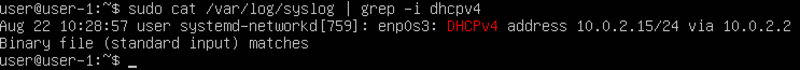

- >Расшифровка DHCP - это сетевой протокол, который автоматически назначает IP-адреса и другие параметры конфигурации сетевым устройствам в сети. Это упрощает процесс настройки сети, исключая необходимость вручную вводить IP-адреса для каждого устройства.

- Внешний ip-адрес шлюза (ip): `curl ifconfig.co`
- Внутренний IP-адрес шлюза, он же ip-адрес по умолчанию (gw): `ip route show default`

  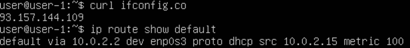

- Статичные (заданные вручную, а не полученные от DHCP-сервера) настройки ip, gw, dns (используются публичный DNS-серверы).
- Конфигурационный файл сети: `sudo nano /etc/netplan/00-installer-config.yaml`

  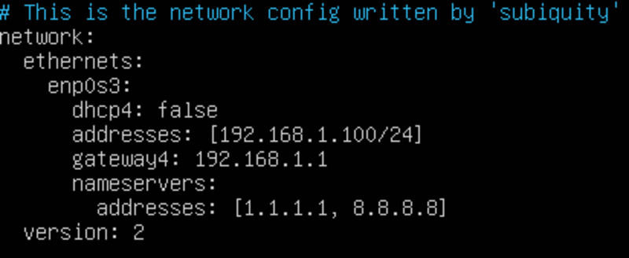

- Сохранение конфигурации: `sudo netplan apply`
- Перезапуск: `sudo reboot`
- Проверка сохранения статичных сетевых настроек (ip, gw, dns).

  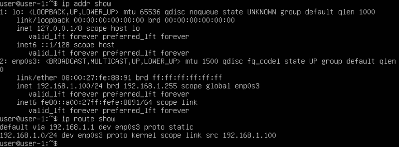

- Пинг удаленных хостов 1.1.1.1 и ya.ru

  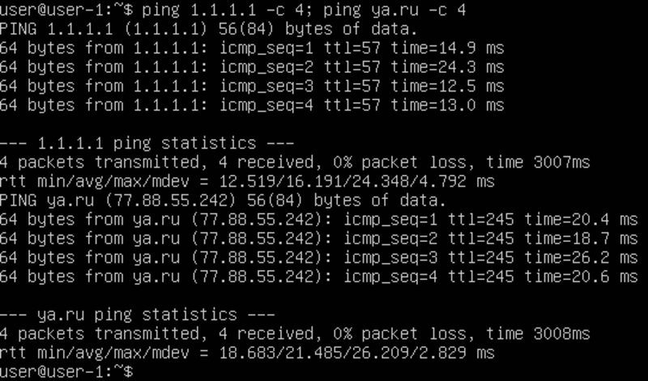

## Part 4. Обновление ОС

- Обновление системных пакетов до последней на момент выполнения задания версии: `sudo apt update` `sudo apt upgrade`
- После обновления системных пакетов, вывод команды обновления повторно:  `sudo apt upgrade`

  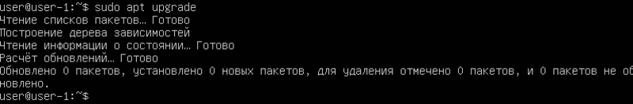

## Part 5. Использование команды sudo

- Добавление в группу sudo: `sudo usermod -aG sudo adm`
- Проверка групп пользователя: `groups adm`

  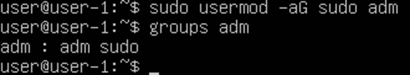

- Замена hostname ОС от имени пользователя: `sudo hostnamectl set-hostname belbysha`

  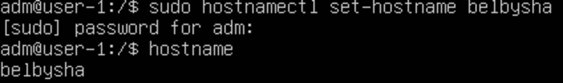

- > Назначение команды sudo: предоставляет возможность пользователям выполнять команды от имени root'а либо других пользователей.

## Part 6. Установка и настройка службы времени

- Настройка службы автоматической синхронизации времени: `sudo timedatectl set-ntp true`

- Вывод время часового пояса, в котором ты сейчас находишься: `timedatectl show`

  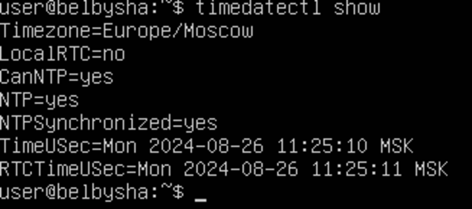

## Part 7. Установка и использование текстовых редакторов

- Установка текстовых редакторов VIM (+ любые два по желанию NANO, MCEDIT, JOE и т. д.): `sudo apt install vim nano mcedit`

- Создание файла test_X.txt, где X — название редактора, в котором создан файл. Напиши в нём свой никнейм, закрой файл с сохранением изменений.
- vim: Вход в режим редактирования `i`, для выхода `ESC`
- Сохранение `:w`, выход: `:q`

  

- nano: Сохранение `CTRL + S`, Выход `CTRL + X`

  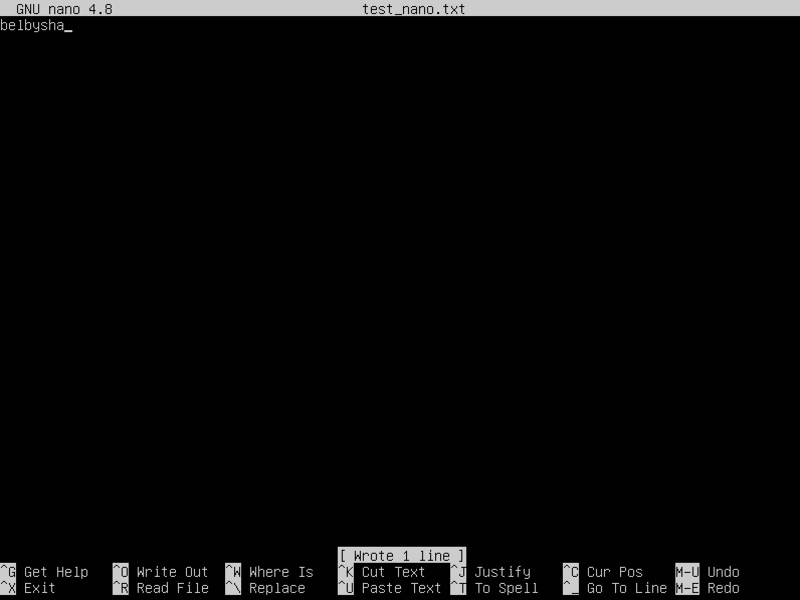

- mcedit: Сохрание `F2` Выход `F10`

  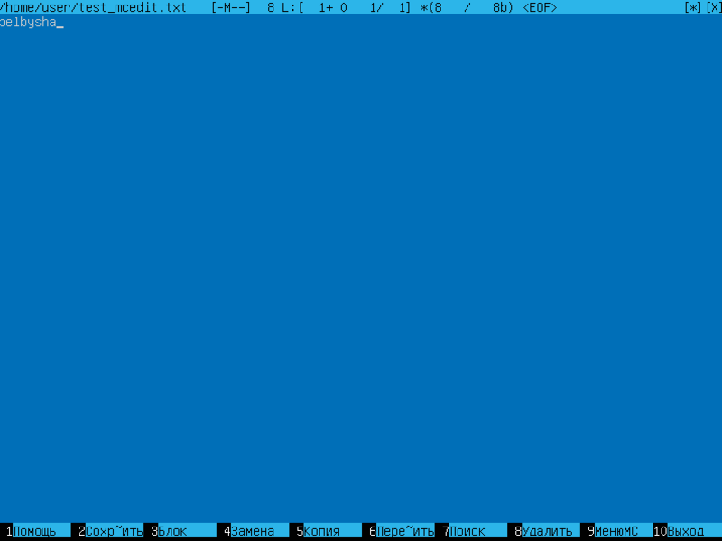

- Открытие файла на редактирование, замена никнейма на строку «21 School 21», закрой файл без сохранения изменений.

- vim: Вход в режим редактирования `i`, для выхода `ESC`
- Выход: `:q!`

  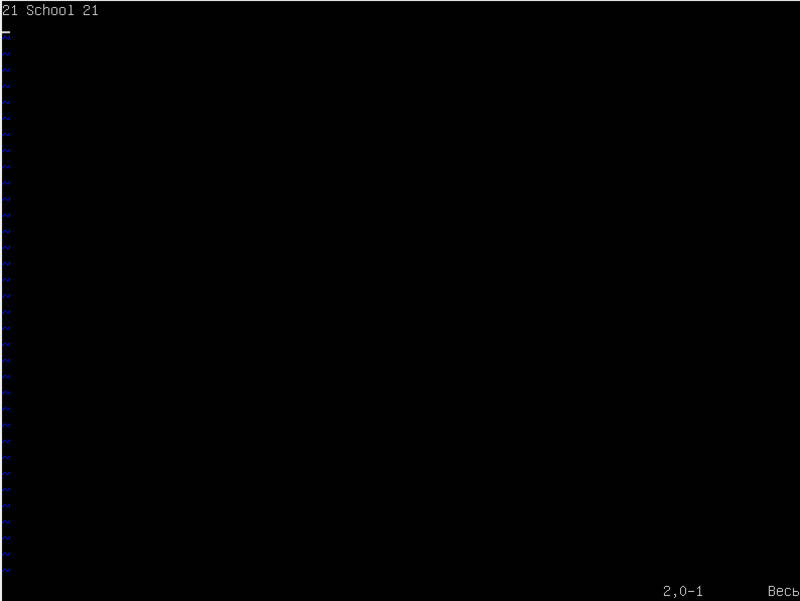

- nano: Выход `CTRL + X`

  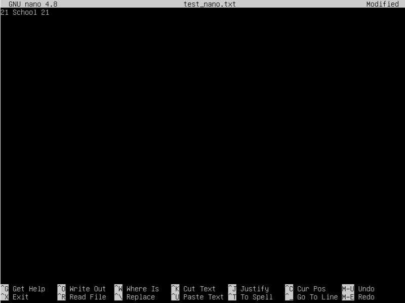

- mcedit: Выход `F10`

  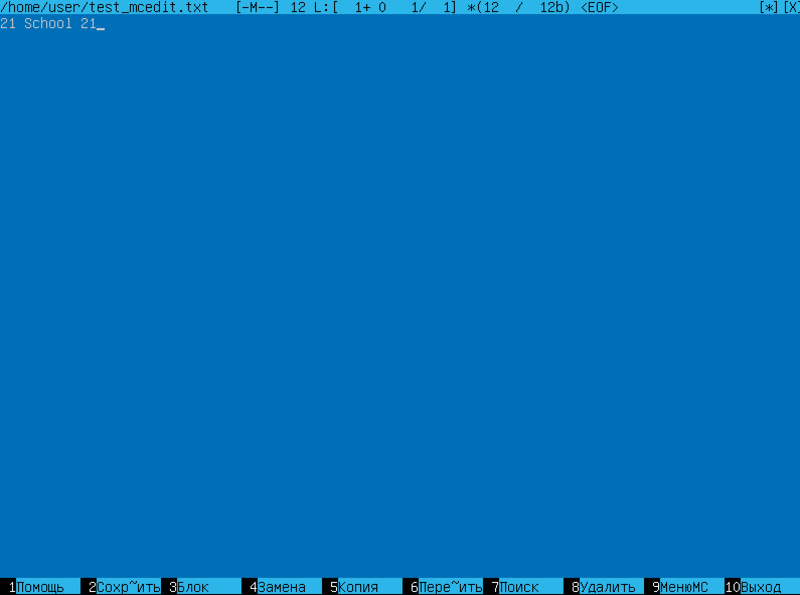

- Редактирование файла ещё раз (по аналогии с предыдущим пунктом), а затем освой функции поиска по содержимому файла (слово) и замены слова на любое другое.

- vim: Базовый поиск `/`, Искать целиком `/\<word\>`
- Замена текста: `:s/<search_phrase>/<replace_phrase>/`

  
  

- nano: Поиск `CTRL + W`
- Замена текста: `CTRL + \`

  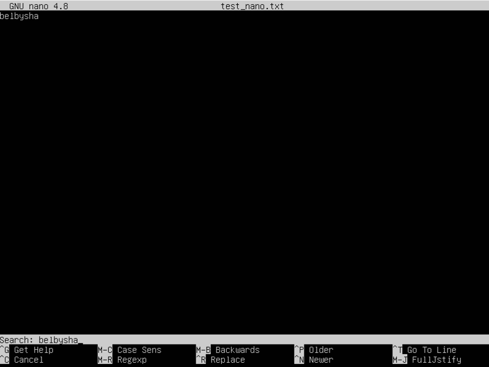
  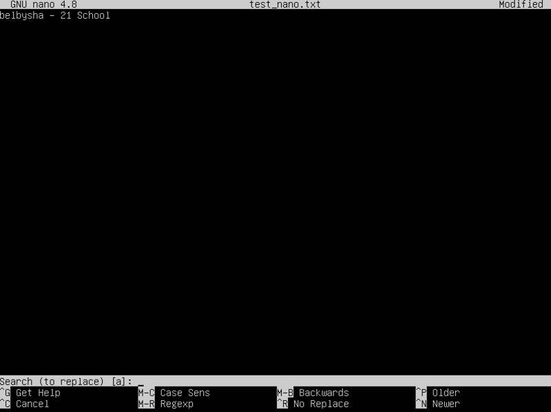

- mcedit: Поиск `F7`
- Замена текста: `F4`

  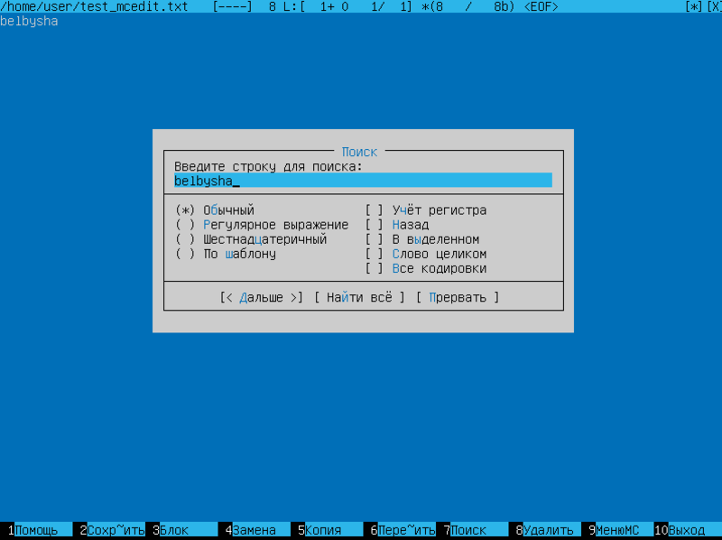
  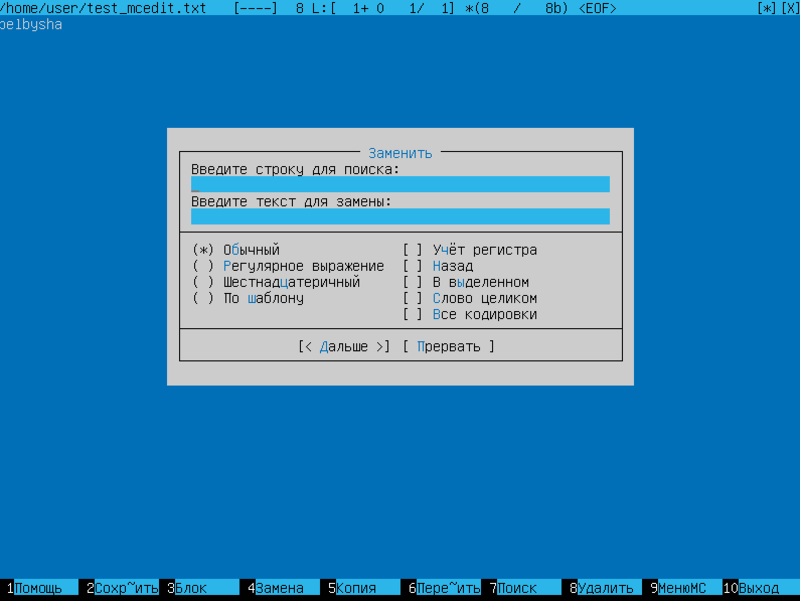

## Part 8. Установка и базовая настройка сервиса SSHD

- Установка службы SSHd: `sudo apt install openssh-server`
- Включение автозапуска: `sudo systemctl enable ssh`
- Выключение автозапуска: `sudo systemctl disable ssh`
- Состояние SSHd службы: `sudo systemctl status ssh`

  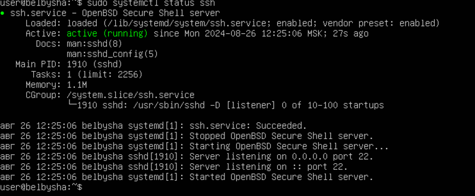

- Перенастройка службы SSHd на порт 2022: `sudo nano /etc/ssh/sshd_config`

  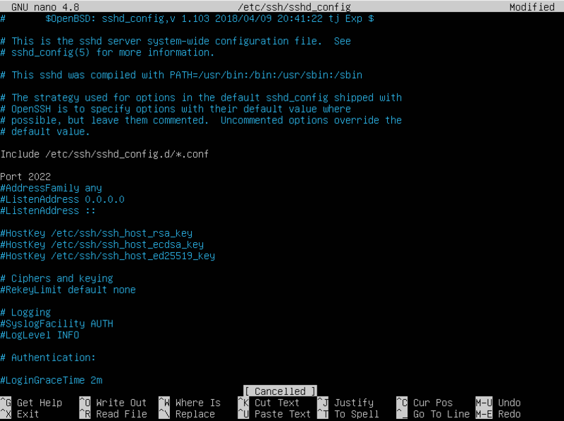

- Перезапуск и просмотр SSHd: `sudo systemctl restart ssh` `sudo systemctl status ssh`'

  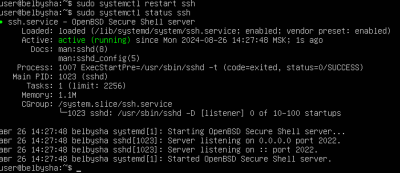

- Наличие процесса sshd: `ps -aux | grep sshd`

  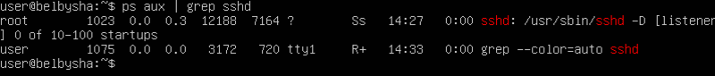

- > ps - Команда для отображения информации о процессах.
  a: Показать процессы всех пользователей. 
  u: Показать дополнительную информацию о пользователе и ресурсах.
  x: Показать процессы без привязки к терминалу. (не имеют интерактивного интерфейса)

- Перезагрузка системы: `sudo reboot`

- Вывод команды: `netstat -tan` 

  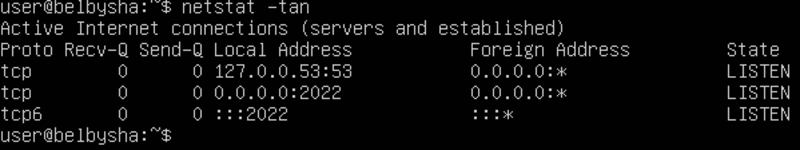

- >  -t: Показывает только TCP-соединения.
  -a: Показывает все соединения и порты, как активные, так и слушающие.
  -n: Показывает IP-адреса и номера портов в числовом формате, без разрешения имен хостов и сервисов.

- > Proto: Тип протокола (например, tcp/upd).
  Recv-Q: Количество байт, ожидающих получения в очереди приема.
  Send-Q: Количество байт, ожидающих отправки в очереди отправки.
  Local Address: Локальный IP-адрес и порт, на котором процесс слушает или с которого установлено соединение.
  Foreign Address: Удаленный IP-адрес и порт, с которыми установлено соединение (или *, если процесс только слушает).
  State: Состояние соединения (например, LISTEN, ESTABLISHED, CLOSE_WAIT и т.д.).

- >  0.0.0.0: Это специальный IP-адрес, означающий, что процесс слушает на всех сетевых интерфейсах машины. То есть, соединения могут поступать как с локального интерфейса, так и с любого другого подключенного интерфейса.

## Part 9. Установка и использование утилит top, htop

- Вывод команды: `top`

  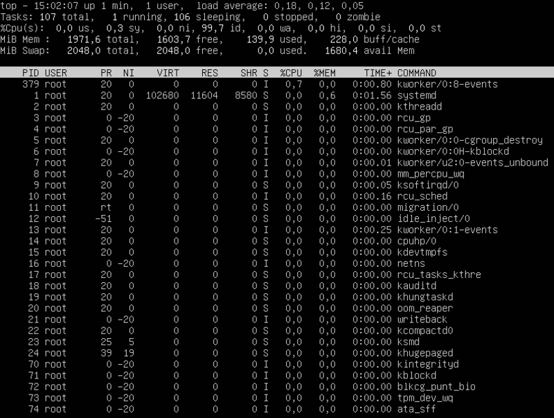

- uptime: `1 min`
- Количество авторизованных пользователей: `1 user`
- Средняя загрузка системы: `0.18`
- Общее количество процессов: `107 `
- Загрузка cpu: `0.3%`
- Загрузка памяти: `139,9` 
- pid процесса, занимающего больше всего памяти: `1 - systemd`
- pid процесса, занимающего больше всего процессорного времени: `1 - systemd`

- Вывод команды `htop`:
- Отсортированному по PERCENT_CPU (по умолчанию)

  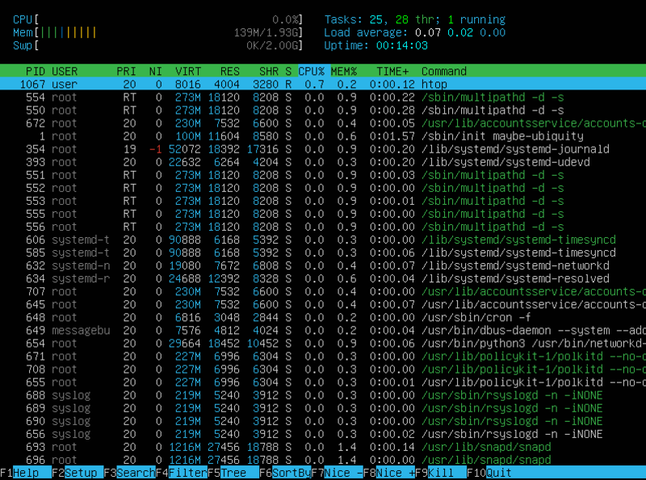

- Отсортированному по PID 

  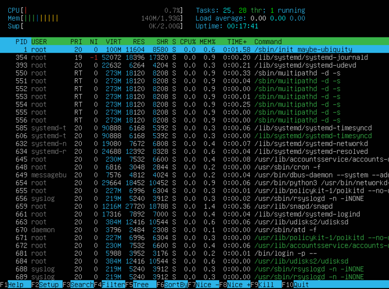

- Отсортированному по PERCENT_MEM

  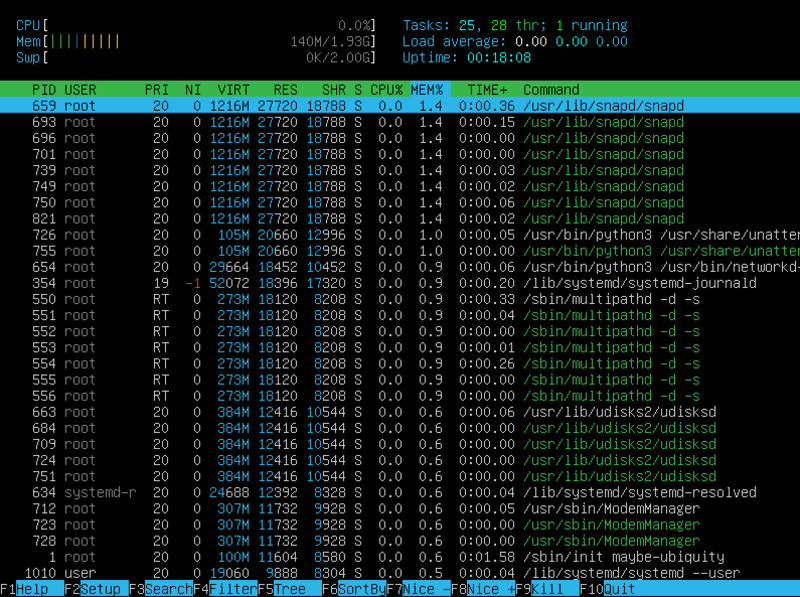

- Отсортированному по TIME 

  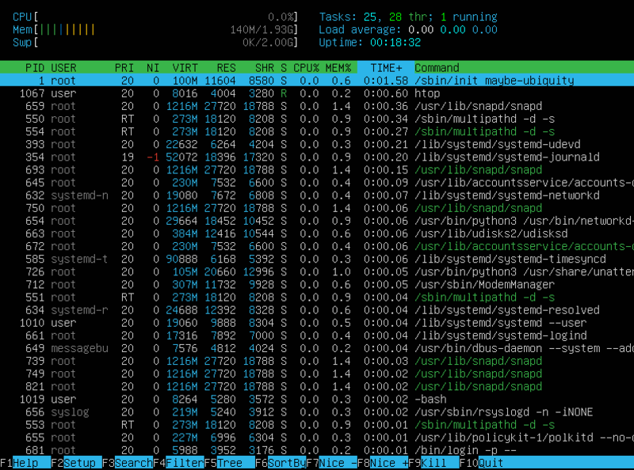

- Отфильтрованному для процесса sshd

  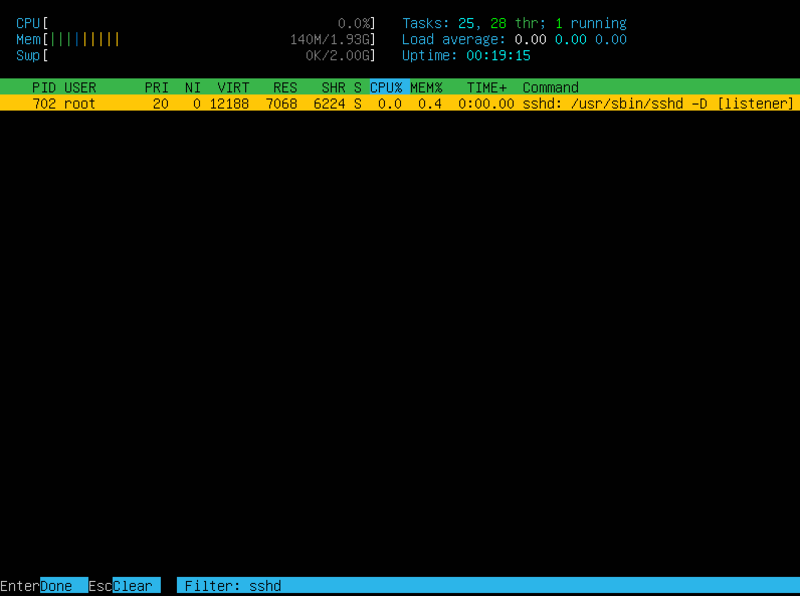

- С процессом syslog, найденным, используя поиск

  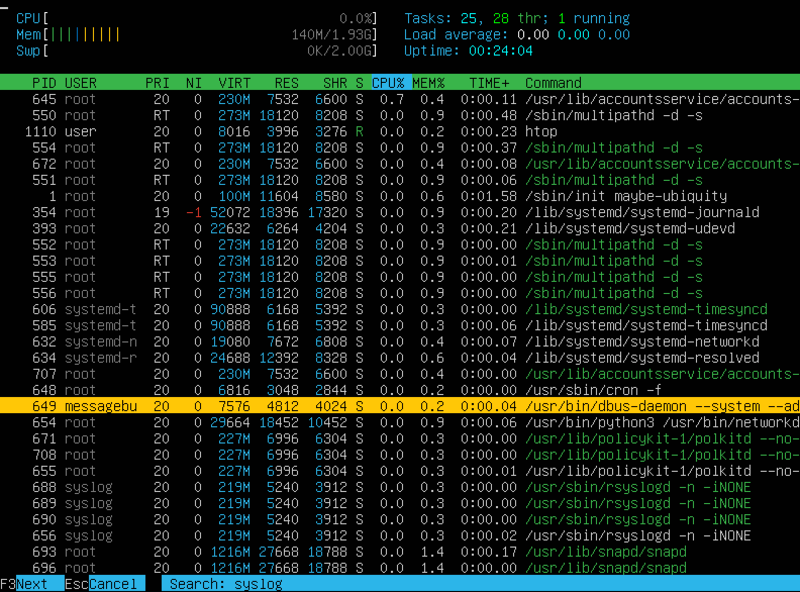

- С добавленным выводом hostname, clock и uptime

  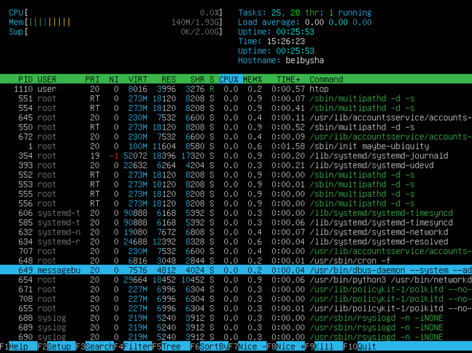

## Part 10. Использование утилиты fdisk

- Запуск команды `sudo fdisk -l`.

  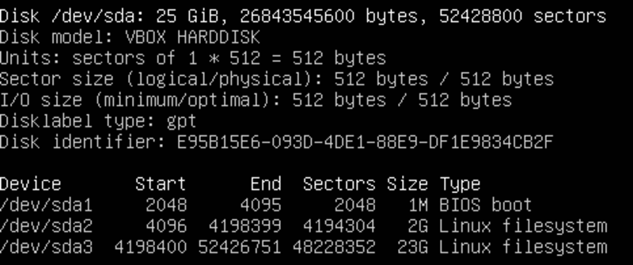

- Название жесткого диска: `VBOX HARDDISK`
- Размер и количество секторов: `25GiB, 52428800 sectors`
- Размер swap: `2GiB` | `free -h` `swapon --show`

## Part 11. Использование утилиты df

- Команда `df /`.

  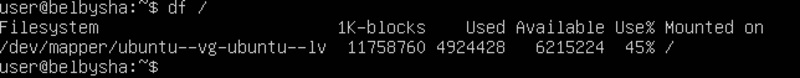

- Размер раздела: `11758760`
- Размер занятого пространства: `4924428`
- Размер свободного пространства: `6215224`
- Процент использования: `45`%
- Единица измерения: `Kib`

-Команда `df -Th /`.

  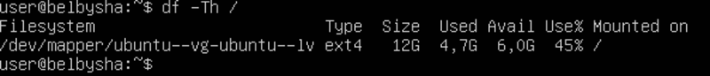

- Размер раздела: `12G`
- Размер занятого пространства: `4.7G`
- Размер свободного пространства: `6.0G`
- Процент использования: `45%`
- Единица измерения: `Gib`

- > Тип файловой системы для раздела: ext4 - Файловая система с журналированием для Linux, разработанная как преемница ext3.

## Part 12. Использование утилиты du

- Команда `sudo du -s` `sudo du -sh`.
- Вывод размер папок /home, /var, /var/log (в байтах -s, в человекочитаемом виде -sh).

  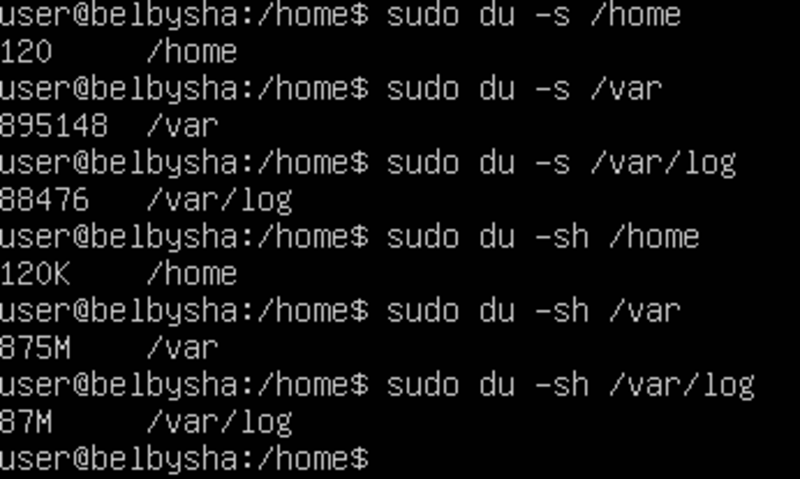

- Команда `sudo du /var/log/*`.
- Вывод размера всего содержимого в /var/log (не общее, а каждого вложенного элемента, используя *).

  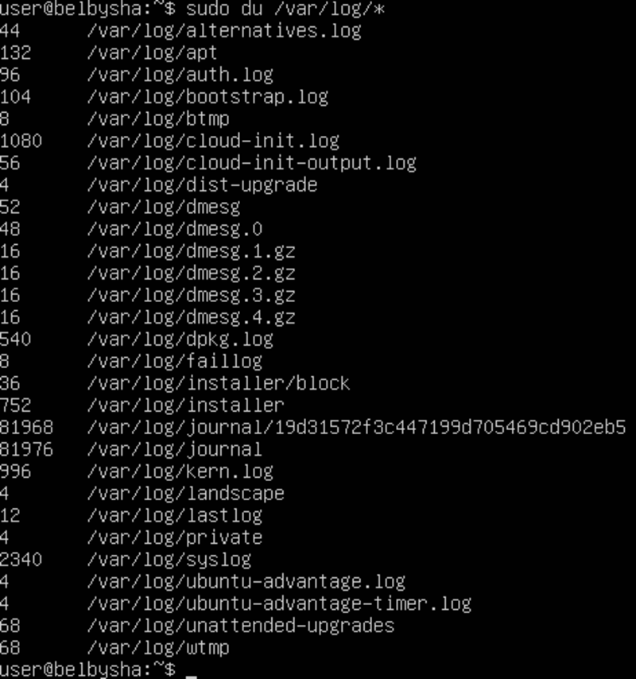

## Part 13. Установка и использование утилиты ncdu

- Установка утилиты ncdu: `sudo apt install ncdu`.
- Вывод размера папок /home, /var, /var/log.

  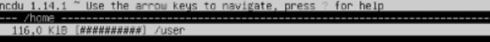

  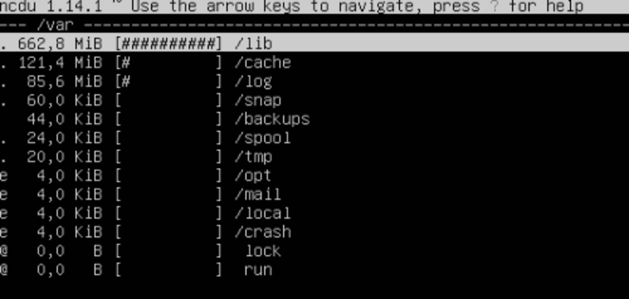

  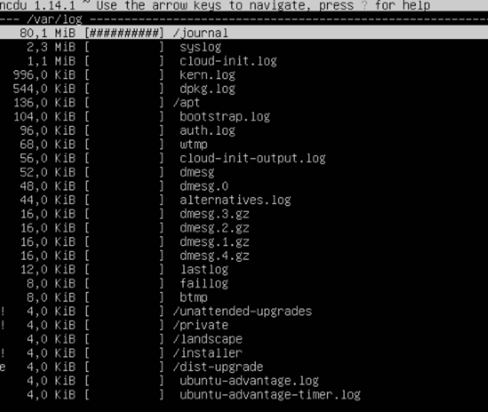

## Part 14. Работа с системными журналами

- Открытие для просмотра:
- /var/log/dmesg

  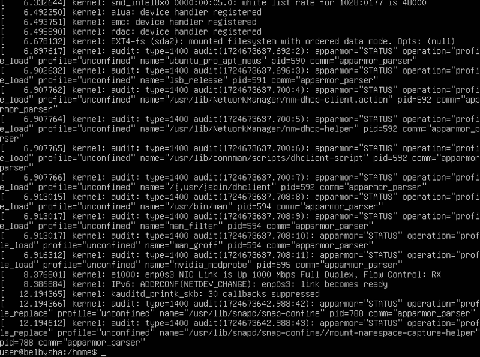

- /var/log/syslog

  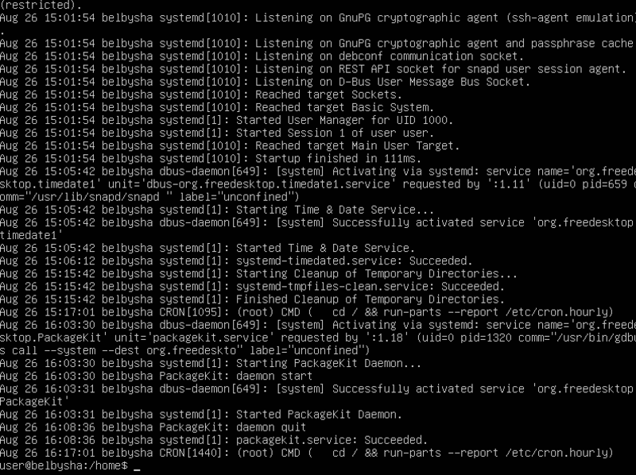

- /var/log/auth.log

  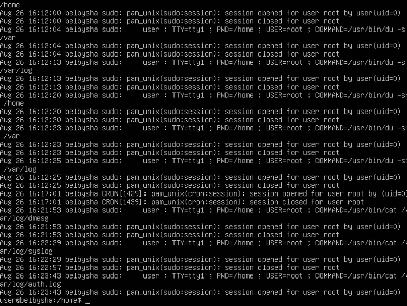

- Время последней успешной авторизации: `Aug 26 16:23`
- Имя пользователя: `user`
- Метод входа в систему: `uid=0`

- Перезапуск службы SSHd: `sudo systemctl restart ssh`
- Сообщение о рестарте службы:

  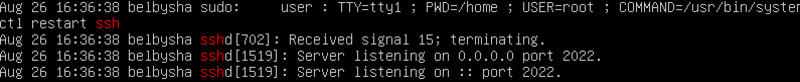

## Part 15. Использование планировщика заданий CRON

- Используя планировщик заданий, запуск команды uptime через каждые 2 минуты.
- Добавление задания `crontab -e`

  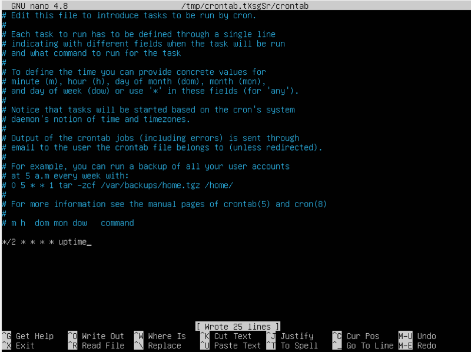

- Поиск в системных журналах строчки (минимум две в заданном временном диапазоне) о выполнении. 

  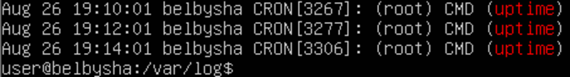

- Вывод на экран список текущих заданий для CRON `crontab -l`.

  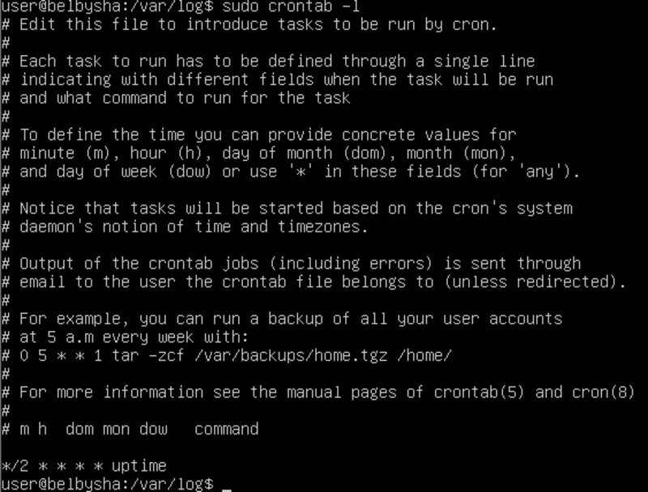

- Удаление всех заданий из планировщика заданий `crontab -r`.

  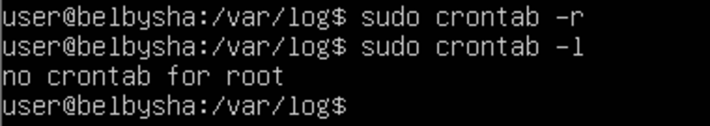
