## Part 1. Инструмент ipcalc

- Подними виртуальную машину (далее -- ws1)

    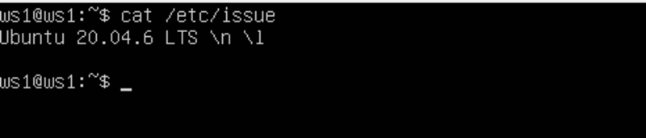

### 1.1. Сети и маски

- Определи и запиши в отчёт:

1) Адрес сети 192.167.38.54/13 `ipcalc 192.167.38.54/13`

    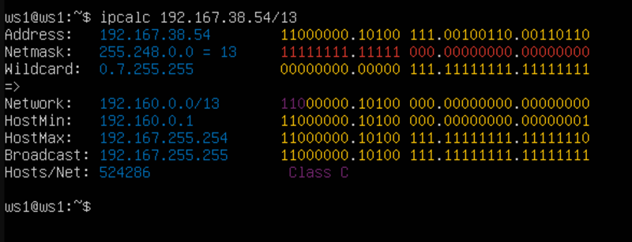

2) Перевод маски
- 255.255.255.0 в префиксную и двоичную запись
    - Префиксная запись: /24
    - Двоичная запись: 11111111.11111111.11111111.00000000

    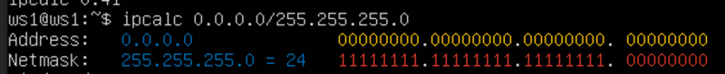

- /15 в обычную и двоичную 
    - Обычная запись: 255.254.0.0
    - Двоичная запись: 11111111.11111110.00000000.00000000

    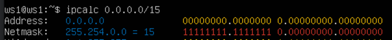

- 11111111.11111111.11111111.11110000 в обычную и префиксную
    - Обычная запись: 255.255.255.240
    - Префиксная запись: /28

    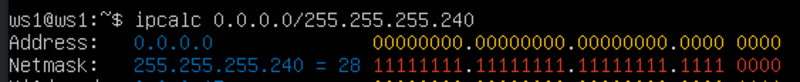

3) Минимальный и максимальный хост в сети 12.167.38.4,при масках:
- /8
  - Минимальный хост: 12.0.0.1
  - Максимальный хост: 12.255.255.254

    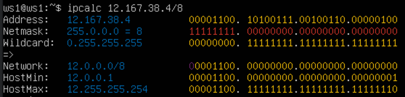

- 11111111.11111111.00000000.00000000
  - Минимальный хост: 12.167.0.1
  - Максимальный хост: 12.167.255.254

    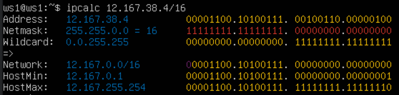

- 255.255.254.0
  - Минимальный хост: 12.167.38.1
  - Максимальный хост: 12.167.39.254

    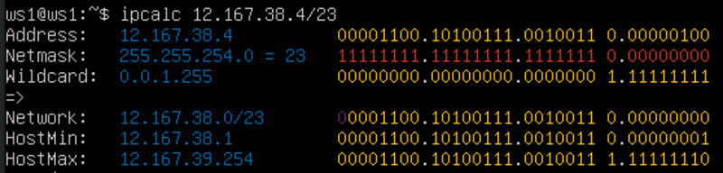

- /4
  - Минимальный хост: 0.0.0.1
  - Максимальный хост: 15.255.255.254

    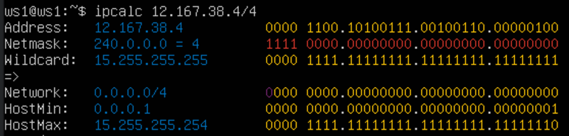
    
### 1.2. localhost

- Определи и запиши в отчёт, можно ли обратиться к приложению, работающему на localhost, со следующими IP: 
  - 194.34.23.100 - нет
  - 127.0.0.2 - да
  - 127.1.0.1 - да
  - 128.0.0.1 - нет
  
  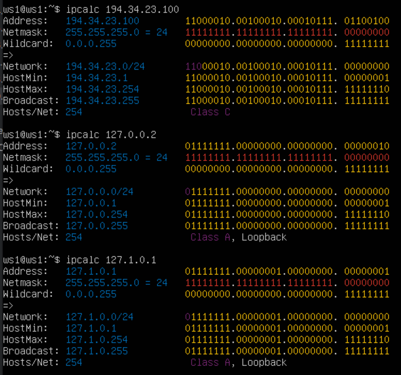 
  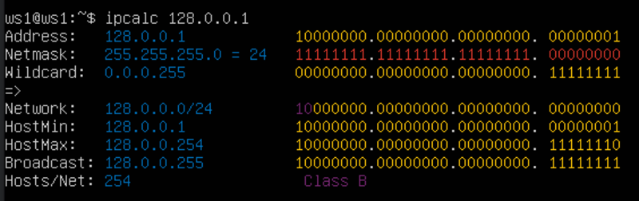

- > Диапазон сетей localhost (127.0.0.0 - 127.255.255.255)

### 1.3. Диапазоны и сегменты сетей

- Определи и запиши в отчёт:

- > К частным "серым" адресам относятся IP-адреса из следующих подсетей:
  > От 10.0.0.0 до 10.255.255.255 с маской 255.0.0.0 или /8 
  > От 100.64.0.0 до 100.127.255.255 с маской подсети 255.192.0.0 или /10; 
  > От 172.16.0.0 до 172.31.255.255 с маской 255.240.0.0 или /12 
  > От 192.168.0.0 до 192.168.255.255 с маской 255.255.0.0 или /16
    
- Частные: 10.0.0.45, 192.168.4.2, 172.20.250.4, 192.172.0.1, 10.10.10.10

  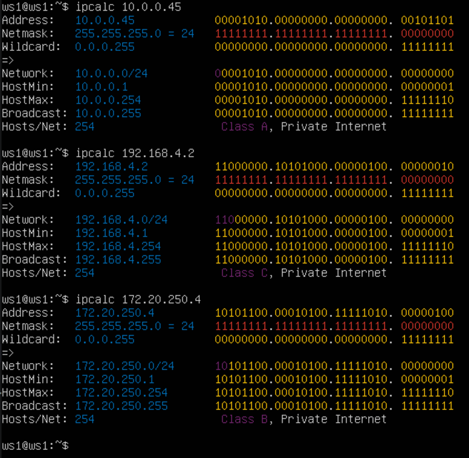 
  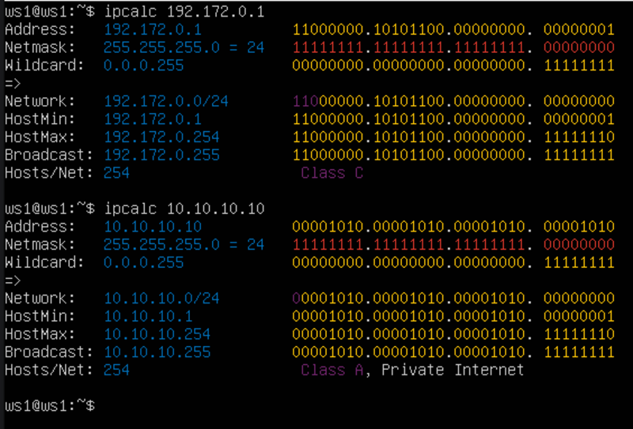 

- Публичные: 134.43.0.2, 172.0.2.1, 192.172.0.1, 172.68.0.2, 192.169.168.1

  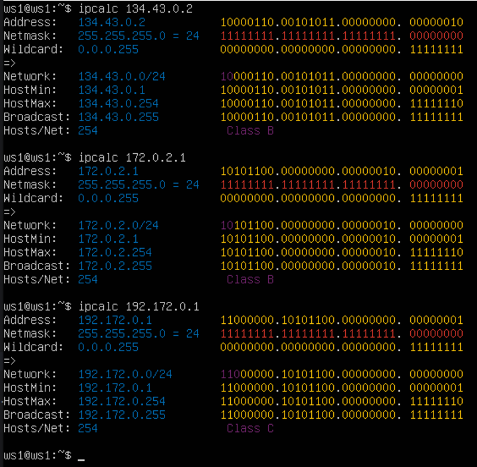 
  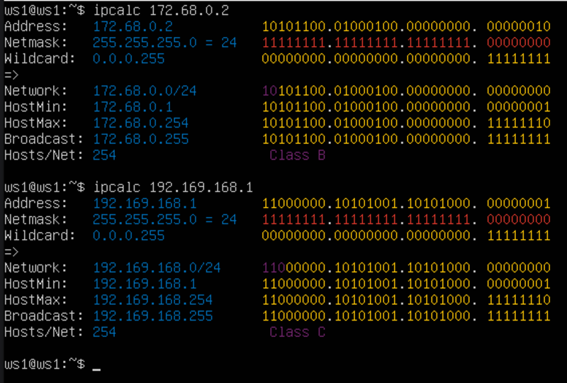 

- Какие из перечисленных IP-адресов шлюза возможны у сети 10.10.0.0/18: 
- Диапазон шлюзов: 10.10.0.0 - 10.10.63.255

  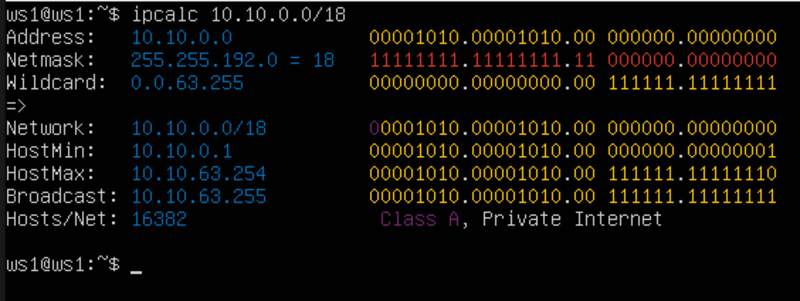 

- Возможно: 10.10.0.2, 10.10.10.10, 10.10.1.255
- Невозможно: 10.0.0.1, 10.10.100.1

## Part 2. Статическая маршрутизация между двумя машинами

- Подними две виртуальные машины (далее -- ws1 и ws2).
- С помощью команды `ip a` посмотри существующие сетевые интерфейсы.

   
  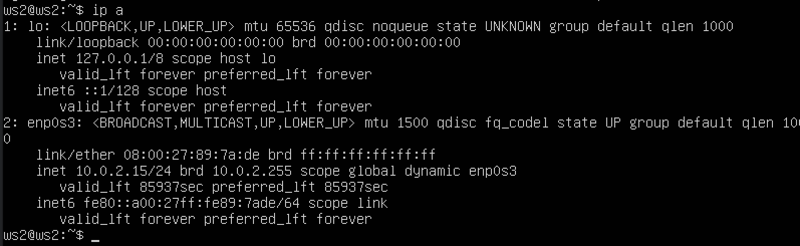 

- Опиши сетевой интерфейс, соответствующий внутренней сети, на обеих машинах и задай следующие адреса и маски:
- Команда редактирования конфигурации: `sudo nano /etc/netplan/00-installer-config.yaml`
- ws1 — 192.168.100.10, маска /16:

  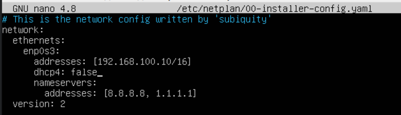

- ws2 — 172.24.116.8, маска /12:

  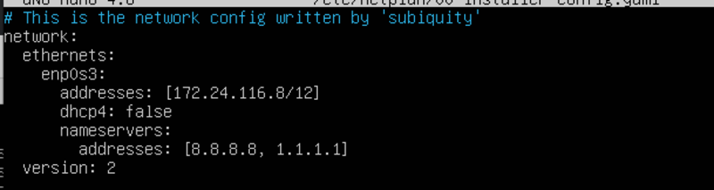

- Выполни команду `netplan apply` для перезапуска сервиса сети.

  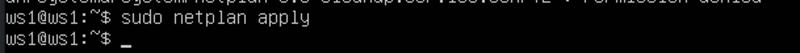 
  

### 2.1. Добавление статического маршрута вручную

- Добавь статический маршрут от одной машины до другой и обратно при помощи команды вида `ip r add`.

  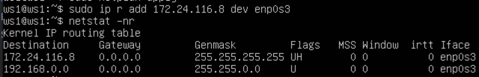 
  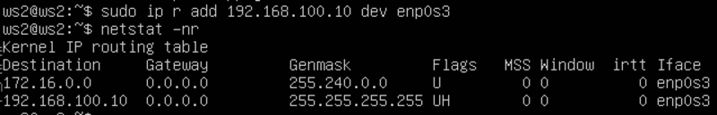

- Пропингуй соединение между машинами.

  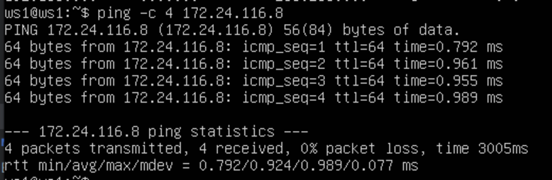 
  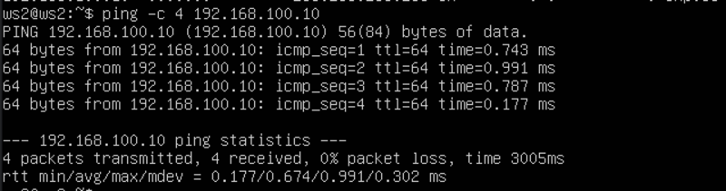

### 2.2. Добавление статического маршрута с сохранением

- Перезапусти машины `reboot`.

- Добавь статический маршрут от одной машины до другой с помощью файла /etc/netplan/00-installer-config.yaml.

  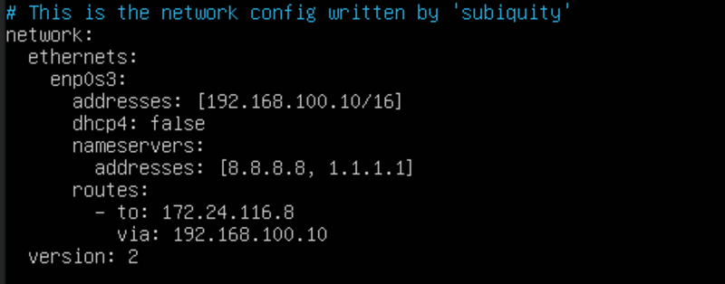 
  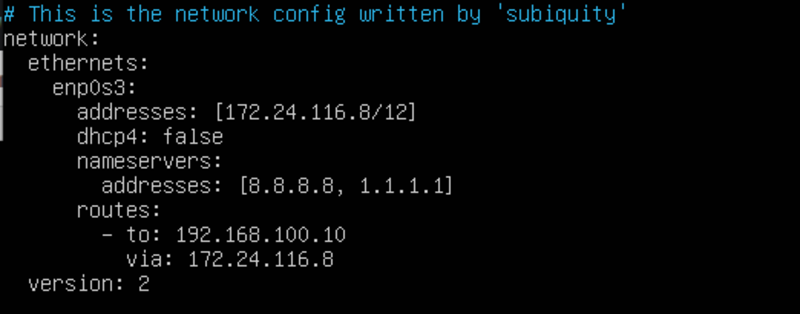

- Пропингуй соединение между машинами.

  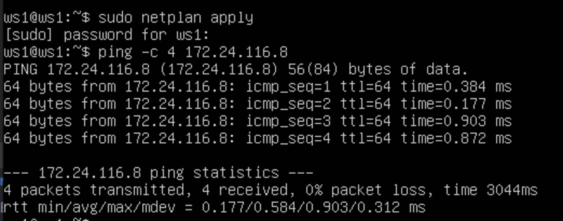 
  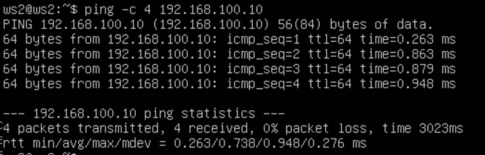

## Part 3. Утилита iperf3

### 3.1. Скорость соединения

- Переведи и запиши в отчёт: 
- 8 Mbps = 1 MB/s
- 100 MB/s = 800000 Kbps
- 1 Gbps = 1000 Mbps.

### 3.2. Утилита iperf3

- Установка утилиты: `sudo apt install iperf3`
- Измерь скорость соединения между ws1 и ws2.
- ws2: `iperf3 -s`

  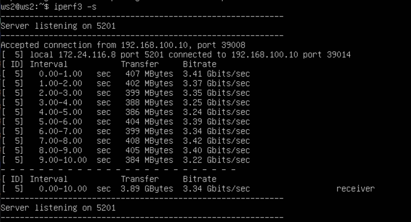 

- ws1: `iperf3 -c 172.24.116.8`

  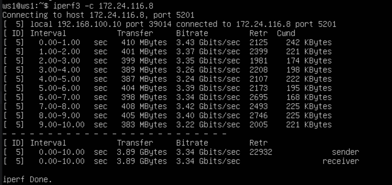

## Part 4. Сетевой экран
- После соединения машин перед нами стоит следующая задача: контролировать информацию, проходящую по соединению. Для этого используются сетевые экраны.
== Задание ==
В данном задании используются виртуальные машины ws1 и ws2 из Части 2

### 4.1. Утилита iptables

- Создай файл /etc/firewall.sh, имитирующий файрвол, на ws1 и ws2:

- ws1: `sudo nano /etc/filewall.sh`

  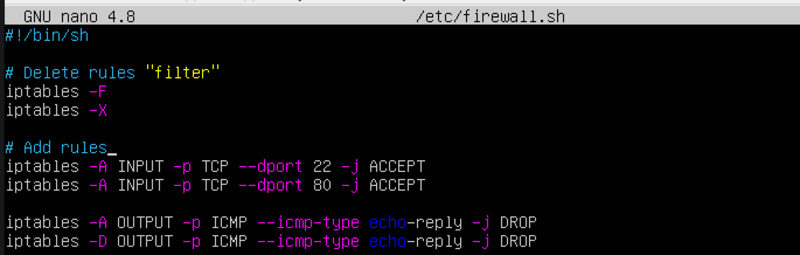

- ws2: `sudo nano /etc/filewall.sh`

  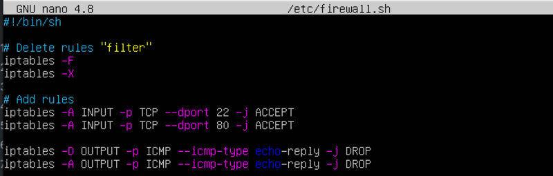

- Запусти файлы на обеих машинах командами `chmod +x /etc/firewall.sh` и `/etc/firewall.sh.`

  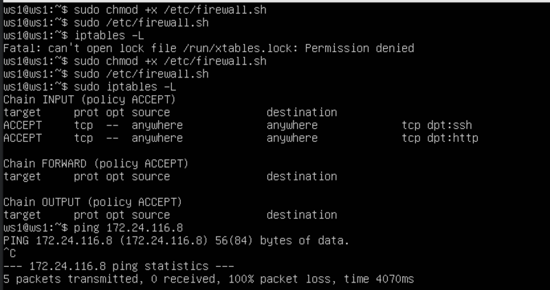
  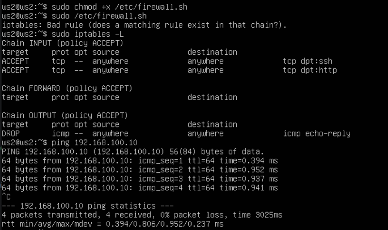

- > Разница между стратегиями: ws2 не пингуется, из-за неверного порядка правил 

### 4.2. Утилита nmap

- Покажи утилитой nmap, что хост машины запущен `nmap 172.24.166.8`.
- В выводе nmap должно быть сказано: Host is up.

  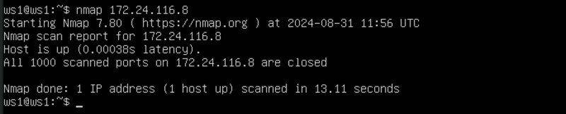

- Сохранил дампы образов виртуальных машин

## Part 5. Статическая маршрутизация сети

- ### Сеть:

  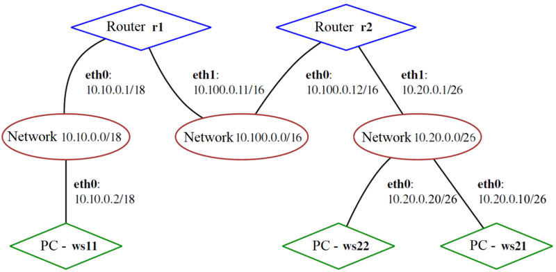

- Подними пять виртуальных машин (3 рабочие станции (ws11, ws21, ws22) и 2 роутера (r1, r2)).

  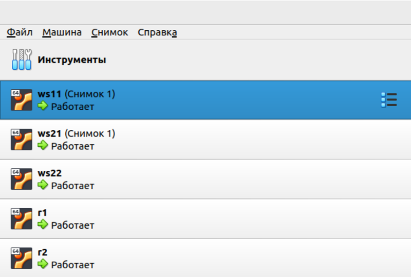

- Настройки сети виртуальных машин:

- Роутер r1:
  - Адаптер_1 (Тип подключения: NAT).
  - Включаем Адаптер_2, выставляем Тип подключения: Внутренняя сеть и устанавливаем имя `intnet0`.
  - Включаем Адаптер_3, выставляем Тип подключения: Внутренняя сеть и устанавливаем имя `intnet1`.

- Роутер r2:
  - Адаптер_1 (Тип подключения: NAT).
  - Включаем Адаптер_2, выставляем Тип подключения: Внутренняя сеть и устанавливаем имя `intnet1`.
  - Включаем Адаптер_3, выставляем Тип подключения: Внутренняя сеть и устанавливаем имя `intnet2`.

- Машина ws11:
  - Адаптер_1 оставляем как есть (Тип подключения: NAT);
  - Включаем Адаптер_2, выставляем Тип подключения: Внутренняя сеть и устанавливаем имя `intnet0`.

- Машина ws21 и ws22:
  - Адаптер_1 оставляем как есть (Тип подключения: NAT);
  - Включаем Адаптер_2, выставляем Тип подключения: Внутренняя сеть и устанавливаем имя `intnet2`.

### 5.1. Настройка адресов машин

- Настрой конфигурации машин в etc/netplan/00-installer-config.yaml согласно сети на рисунке.
- Сохранение изменений `sudo netplan apply`
- r1 etc/netplan/00-installer-config.yaml

  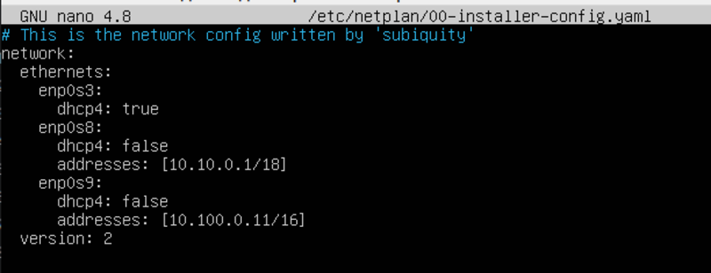

- r2 etc/netplan/00-installer-config.yaml

  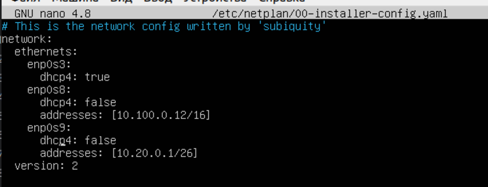

- ws11 etc/netplan/00-installer-config.yaml

  

- ws21 etc/netplan/00-installer-config.yaml

  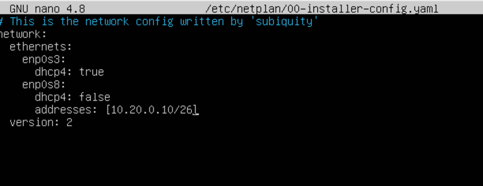

- ws22 etc/netplan/00-installer-config.yaml

  

- Командой ip -4 a проверь, что адрес машины задан верно. 

- r1 Вызов `ip -4 a`

  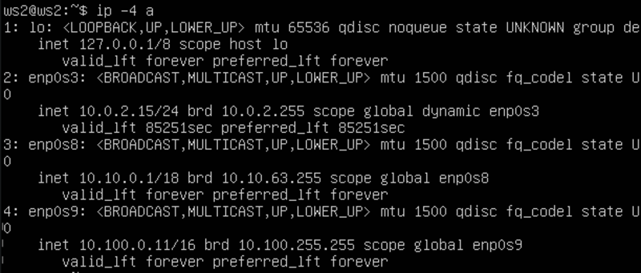

- r2 Вызов `ip -4 a`

  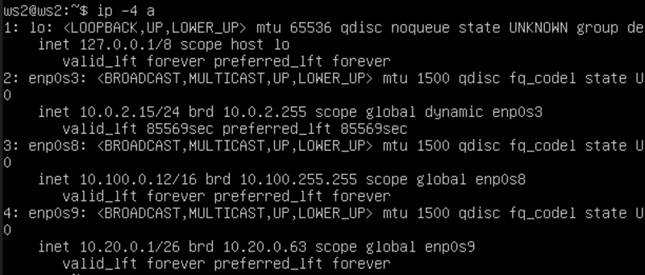

- ws11 Вызов `ip -4 a`

  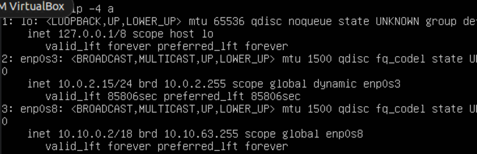

- ws21 Вызов `ip -4 a`

  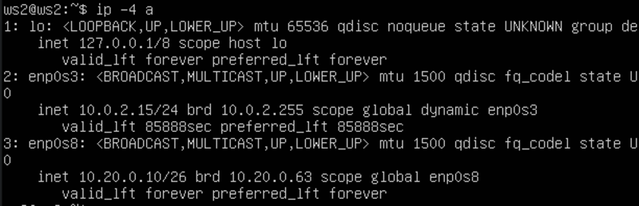

- ws22 Вызов `ip -4 a`

  

- Проверка соединения ws22 с ws21. 

  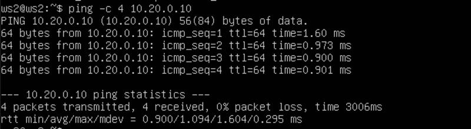

- Проверка соединения r1 с ws11.

  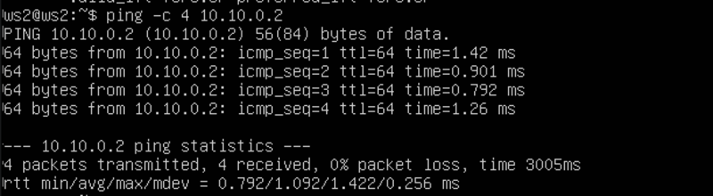

### 5.2. Включение переадресации IP-адресов

- Для включения переадресации IP выполни команду на роутерах: `sysctl -w net.ipv4.ip_forward=1`
- При таком подходе переадресация не будет работать после перезагрузки системы.

- r1 Вызов команды `sysctl -w net.ipv4.ip_forward=1`:

  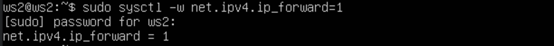

- r2 Вызов команды `sysctl -w net.ipv4.ip_forward=1`:

  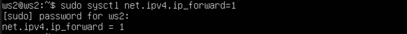

- Открой файл /etc/sysctl.conf и добавь в него следующую строку: `net.ipv4.ip_forward = 1`
- При использовании этого подхода, IP-переадресация включена на постоянной основе.

- r1 `/etc/sysctl.conf`:

  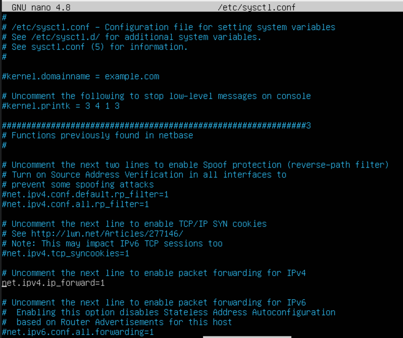

- r2 `/etc/sysctl.conf`:

  

### 5.3. Установка маршрута по умолчанию

- Настрой маршрут по умолчанию (шлюз) для рабочих станций. Для этого добавь default перед IP-роутера в файле конфигураций.
- Вызови ip r и покажи, что добавился маршрут в таблицу маршрутизации.

- ws11 `etc/netplan/00-installer-config.yaml`;

  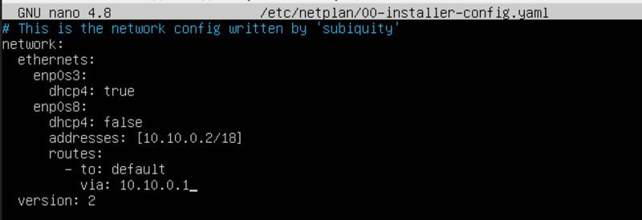

- ws11 `ip r`

  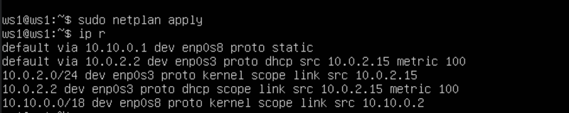

- ws21 `etc/netplan/00-installer-config.yaml`;

  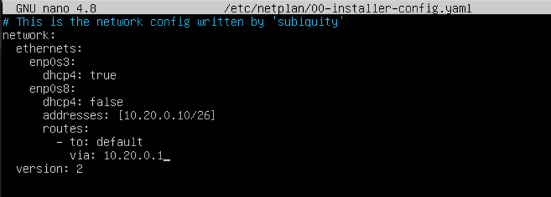

- ws21 `ip r`

  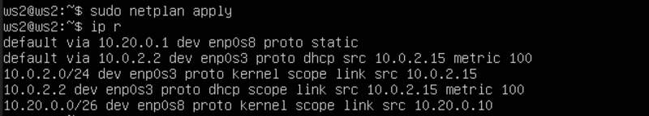

- ws22 `etc/netplan/00-installer-config.yaml`;

  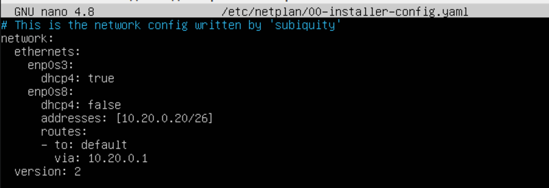

- ws22 `ip r`

  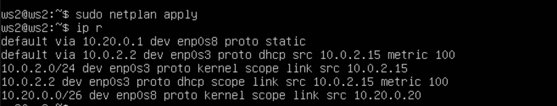

- Пропингуй с ws11 роутер r2 и покажи на r2, что пинг доходит. 
- Команда: `tcpdump -tnv -i enp0s8`

  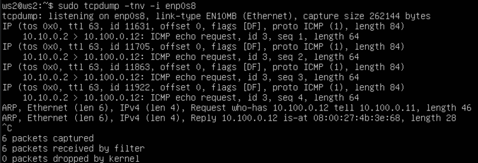

### 5.4. Добавление статических маршрутов

- Добавь в роутеры r1 и r2 статические маршруты в файле конфигураций. 

- r1 `etc/netplan/00-installer-config.yaml`

  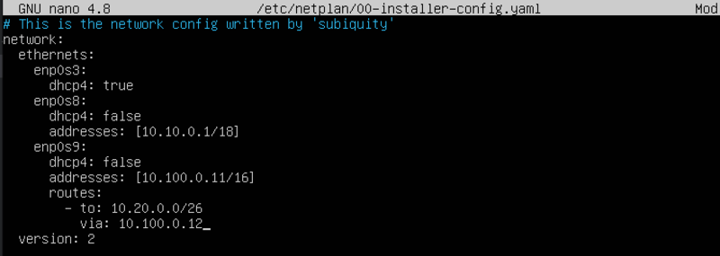

- r2 `etc/netplan/00-installer-config.yaml`

  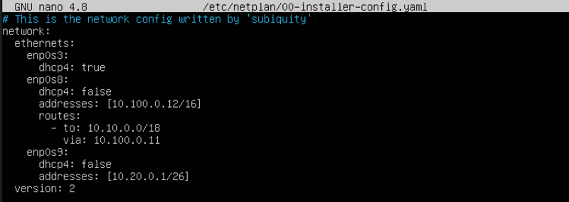

- Вызови ip r и покажи таблицы с маршрутами на обоих роутерах. 

- r1 `ip r`

  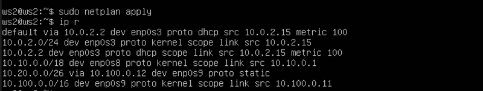

- r2 `ip r`

  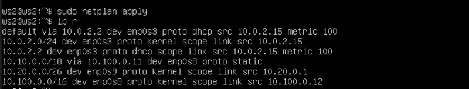

- Запусти команды на ws11: `ip r list 10.10.0.0/[маска сети]` и `ip r list 0.0.0.0/0`

  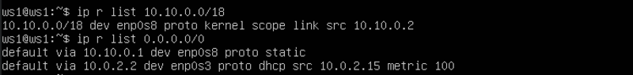

- > Для адреса 10.10.0.0/18 был выбран маршрут, отличный от 0.0.0.0/0, потому что маршрут 10.10.0.0/18 является более специфическим и лучше подходит для данного адреса. В маршрутизации всегда предпочитается маршрут с наименьшей маской сети
  
### 5.5. Построение списка маршрутизаторов

- Запусти на r1 команду дампа: `tcpdump -tnv -i enp0s8`
- При помощи утилиты traceroute построй список маршрутизаторов на пути от ws11 до ws21.

  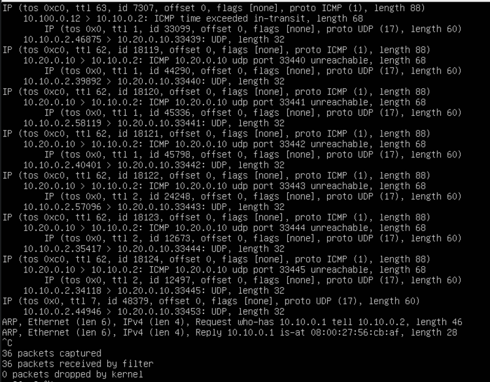
  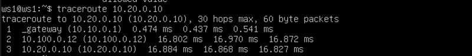

- > Принцип работы построения пути при помощи traceroute. traceroute определяет маршрут данных от вашего компьютера до целевого хоста, отправляя пакеты с постепенно увеличивающимся значением TTL и фиксируя IP-адреса промежуточных маршрутизаторов. Он измеряет время задержки на каждом этапе и помогает выявить маршруты и возможные проблемы в сети.
  
### 5.6. Использование протокола ICMP при маршрутизации

- Запусти на r1 перехват сетевого трафика, проходящего через eth0 с помощью команды:
- r1 `tcpdump -n -i enp0s8 icmp`

  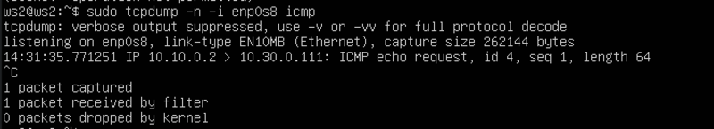

- Пропингуй с ws11 несуществующий IP (например, 10.30.0.111) с помощью команды: `ping -c 1 10.30.0.111`

  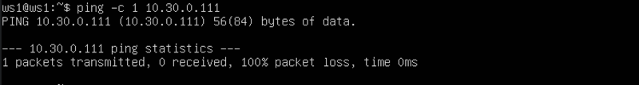

- Сохранил дампы образов виртуальных машин.

## Part 6. Динамическая настройка IP с помощью DHCP

- Установка утилиты `sudo apt install isc-dhcp-server`
- Для r2 настрой в файле /etc/dhcp/dhcpd.conf конфигурацию службы DHCP:

1) Укажи адрес маршрутизатора по умолчанию, DNS-сервер и адрес внутренней сети:

-  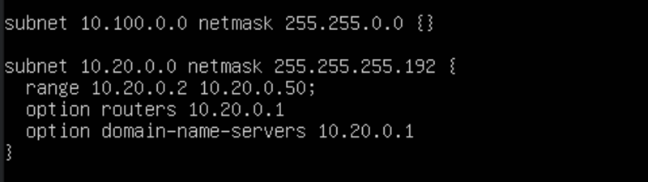

2) В файле resolv.conf пропиши nameserver 8.8.8.8.

-  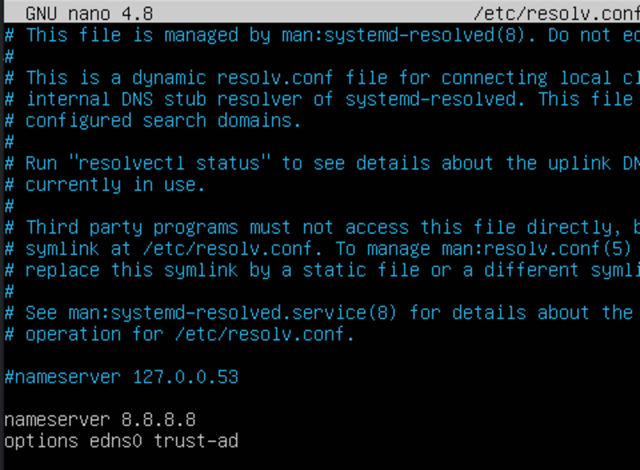

- Перезагрузи службу DHCP командой `systemctl restart isc-dhcp-server`. 

  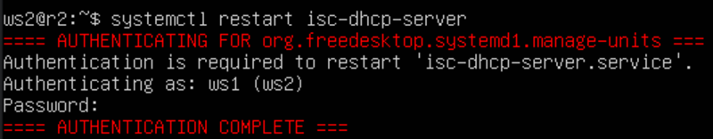

- Машину ws21 перезагрузи при помощи reboot и через ip a покажи, что она получила адрес. 

  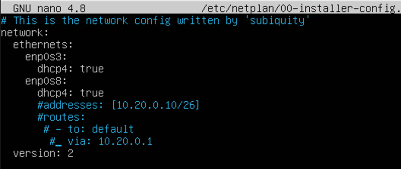
  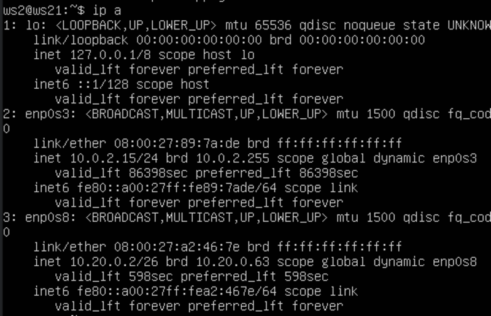

- Также пропингуй ws22 с ws21.

  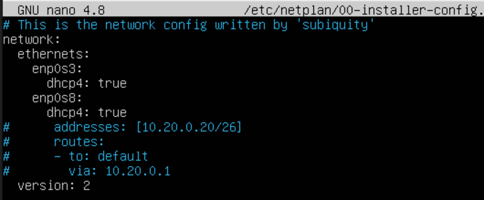
  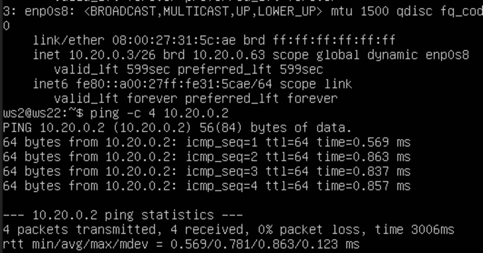

- Укажи MAC-адрес у ws11, для этого в etc/netplan/00-installer-config.yaml надо добавить строки: macaddress: 10:10:10:10:10:BA, dhcp4: true.

  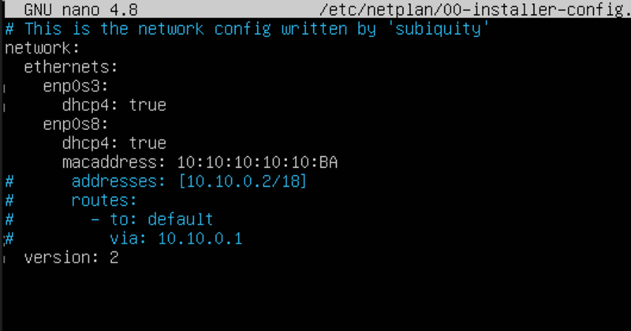

- Прописываем MAC-адрес в настройках сети:

  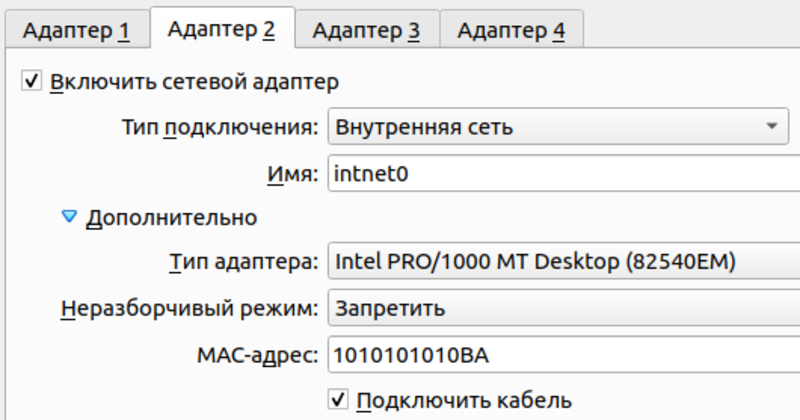

- Для r1 настрой аналогично r2, но сделай выдачу адресов с жесткой привязкой к MAC-адресу (ws11). Проведи аналогичные тесты.

- Адрес маршрутизатора по умолчанию, DNS-сервер и адрес внутренней сети:

  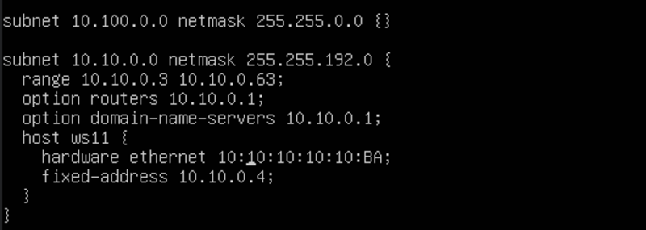

- resolv.conf: nameserver 8.8.8.8:

  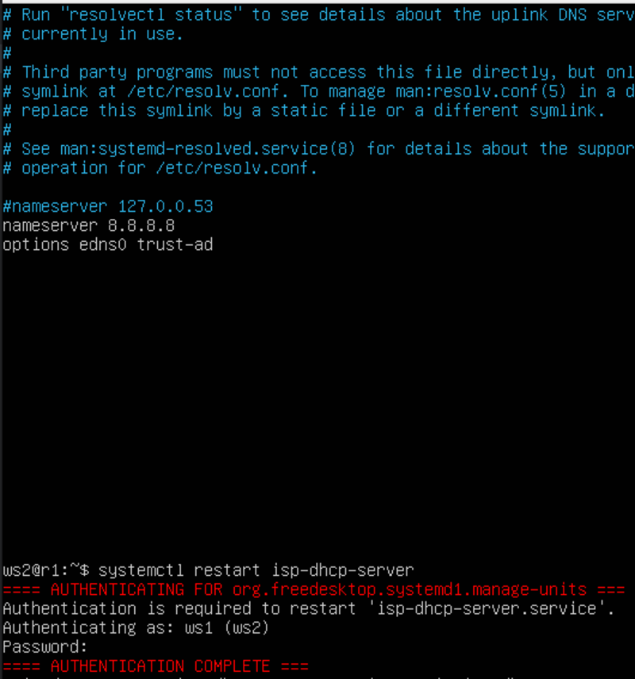

- Перезагрузка службы DHCP командой `systemctl restart isc-dhcp-server`. 

  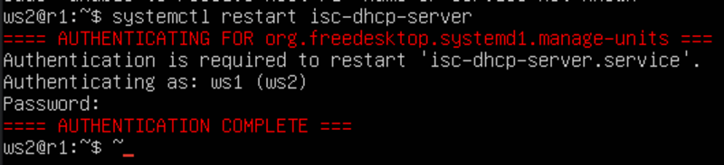

- Машину ws11 перезагрузи при помощи reboot и через ip a покажи, что она получила адрес. 

  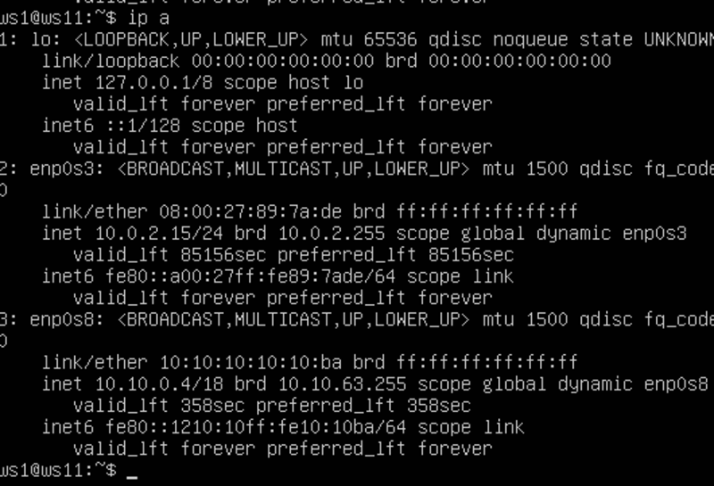

- Также пропингуй ws22 с ws11.

  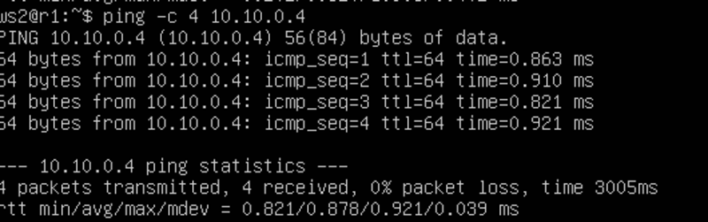

- Запроси с ws21 обновление IP-адреса.
- До обновления `ip a`:

  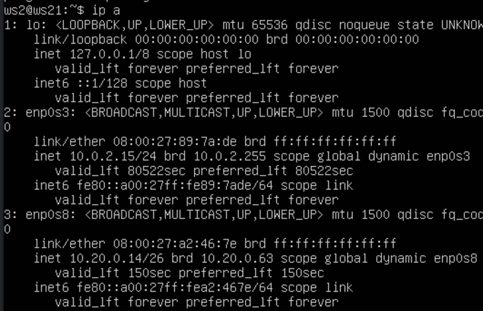

- После обновления `sudo dhclient -v`:

  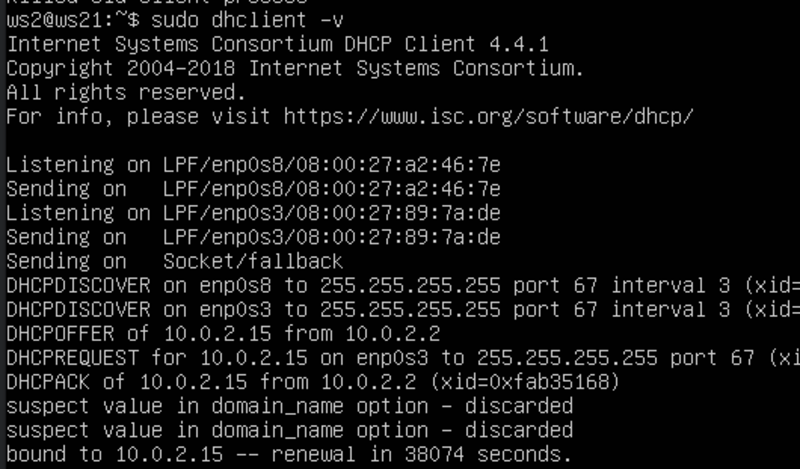
  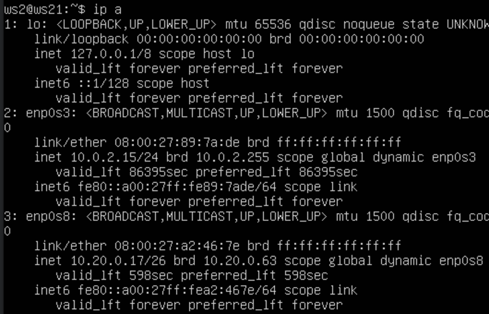

- Удаление `sudo dhclient -r`:

  

- > Опции DHCP сервера, которыми пользовался в данном пункте: option routers и option domain-name-servers используются для указания маршрутизатора по умолчанию и DNS-серверов соответственно.

- Сохранил дампы образов виртуальных машин.

## Part 7. NAT

- Установка: `sudo apt install apache2`
- В файле /etc/apache2/ports.conf на ws22 и r1 измени строку `Listen 80` на `Listen 0.0.0.0:80`, то есть сделай сервер Apache2 общедоступным.

  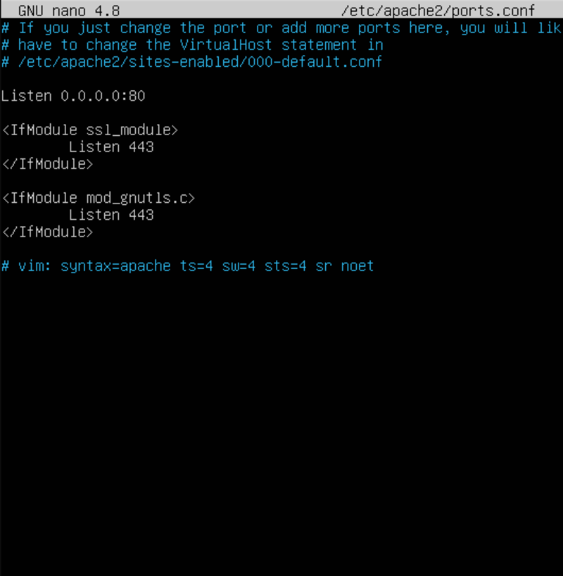
  

- Запусти веб-сервер Apache командой `service apache2 start` на ws22 и r1.

  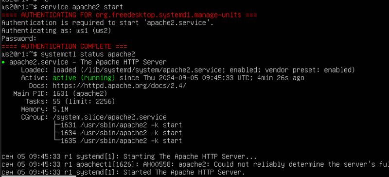
  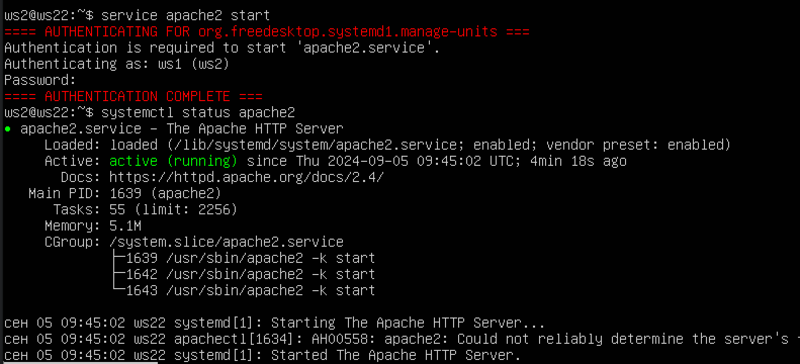

- Добавь в фаервол, созданный по аналогии с фаерволом из Части 4, на r2 следующие правила:

1) Удаление правил в таблице `filter — iptables -F`;
2) Удаление правил в таблице «NAT» — `iptables -F -t nat`;
3) Отбрасывать все маршрутизируемые пакеты — `iptables --policy FORWARD DROP`.
- `/etc/firewall.sh`

  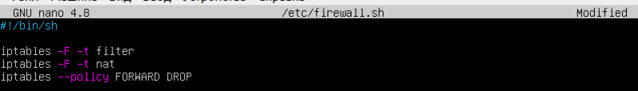

- Запусти файл также, как в Части 4.

  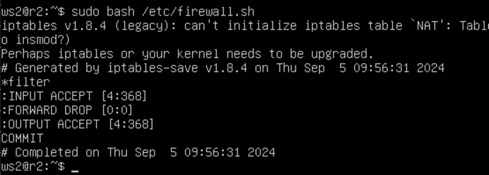

- Проверь соединение между ws22 и r1 командой ping.
- При запуске файла с этими правилами, ws22 не должна «пинговаться» с r1.

  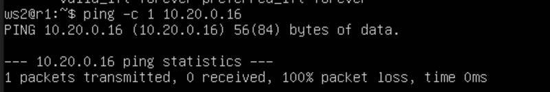
  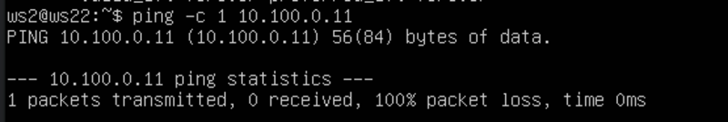

- Добавь в файл ещё одно правило:

4) Разрешить маршрутизацию всех пакетов протокола ICMP.
- Запусти файл также, как в Части 4.

  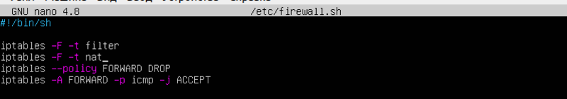
  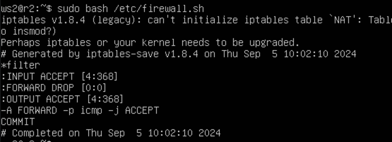

- Проверь соединение между ws22 и r1 командой ping.
- При запуске файла с этими правилами, ws22 должна «пинговаться» с r1.

  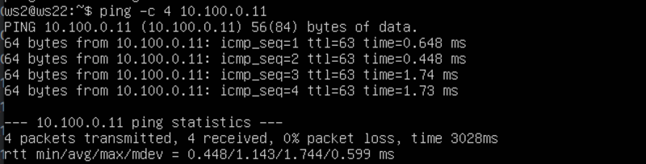

- Добавь в файл ещё два правила:

5) Включи SNAT, а именно маскирование всех локальных IP из локальной сети, находящейся за r2 (по обозначениям из Части 5 — сеть 10.20.0.0).
Совет: стоит подумать о маршрутизации внутренних пакетов, а также внешних пакетов с установленным соединением.

6) Включи DNAT на 8080 порт машины r2 и добавить к веб-серверу Apache, запущенному на ws22, доступ извне сети.
Совет: стоит учесть, что при попытке подключения возникнет новое tcp-соединение, предназначенное ws22 и 80 порту.

-  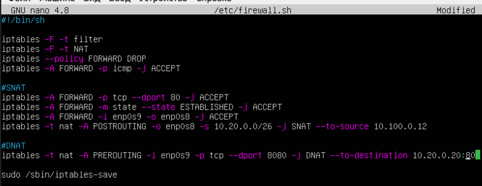

- Запусти файл также, как в Части 4.

  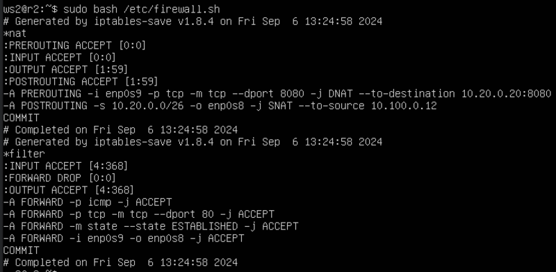

- Проверь соединение по TCP для SNAT: для этого с ws22 подключиться к серверу Apache на r1 командой: `telnet [адрес] [порт]`

  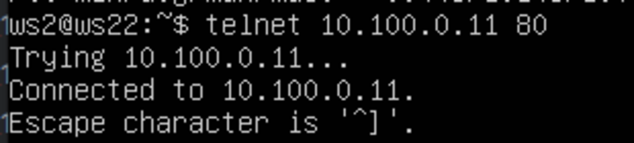
  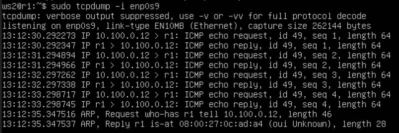
  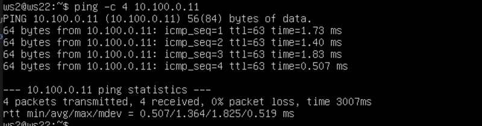

- Проверь соединение по TCP для DNAT: для этого с r1 подключиться к серверу Apache на ws22 командой telnet (обращаться по адресу r2 и порту 8080).

  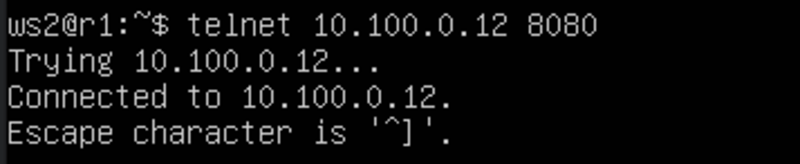

- Сохранил дампы образов виртуальных машин.

## Part 8. Дополнительно. Знакомство с SSH Tunnels

- Установка утилиты: `sudo apt install openssh-server`

- Запусти на r2 фаервол с правилами из Части 7.

  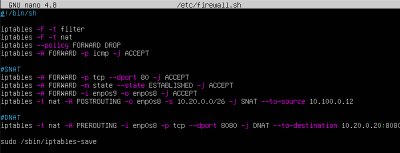
  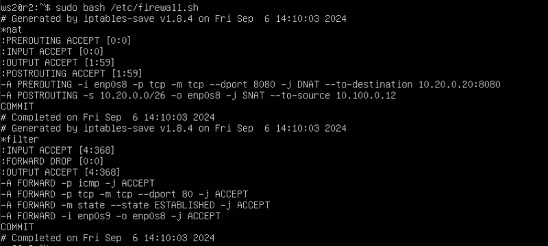

- Запусти веб-сервер Apache на ws22 только на localhost (то есть в файле /etc/apache2/ports.conf измени строку Listen 80 на Listen localhost:80).

  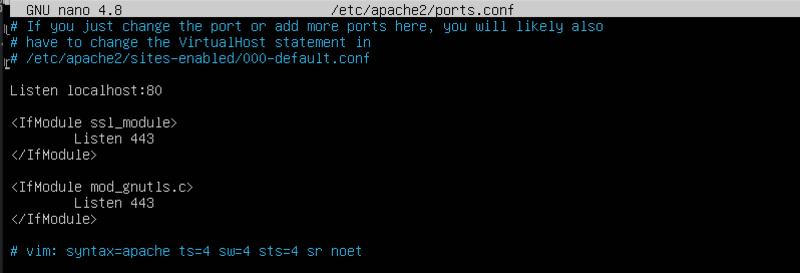
  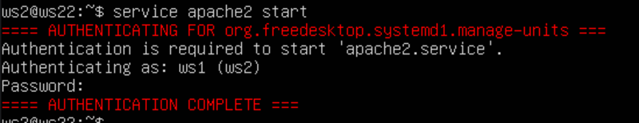

- Воспользуйся Local TCP forwarding с ws21 до ws22, чтобы получить доступ к веб-серверу на ws22 с ws21.
- `ssh -L 8080:localhost:80 ws2@10.20.0.20`

  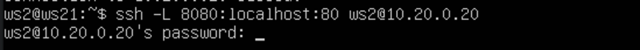
  

- Воспользуйся Remote TCP forwarding c ws11 до ws22, чтобы получить доступ к веб-серверу на ws22 с ws11.
- `ssh -R 8080:localhost:80 ws2@10.20.0.20`

  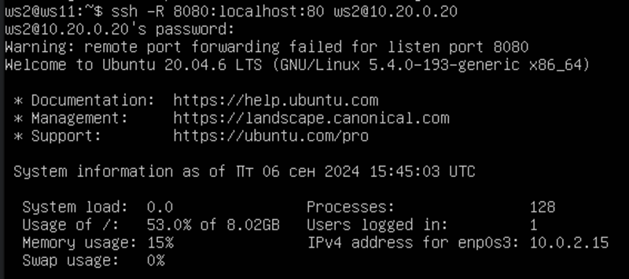

- Для проверки, сработало ли подключение в обоих предыдущих пунктах, перейди во второй терминал (например, клавишами Alt + F2) и выполни команду:
`telnet 127.0.0.1 [локальный порт]`

  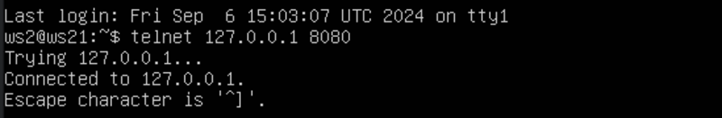

- Сохранил дампы образов виртуальных машин.
