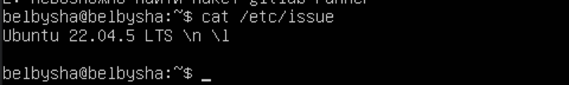
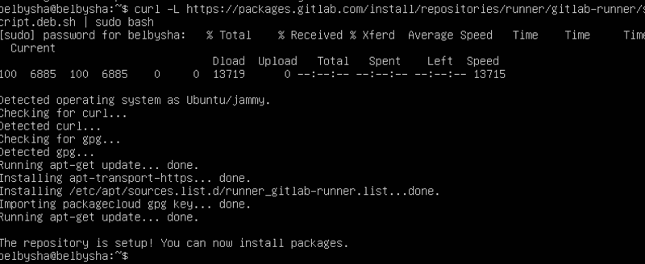
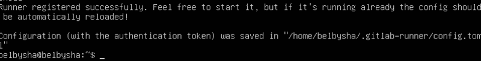
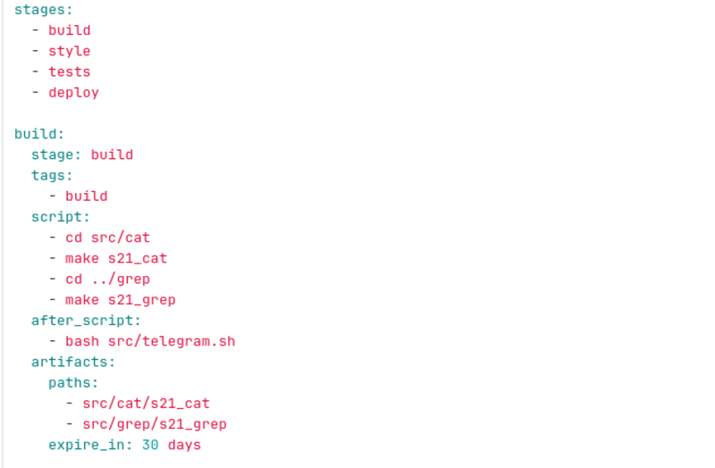
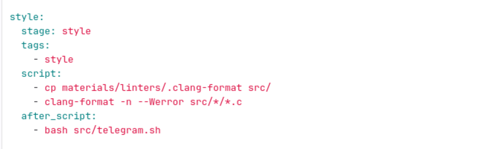
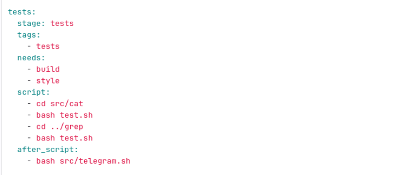
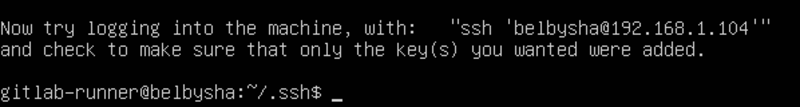
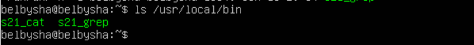
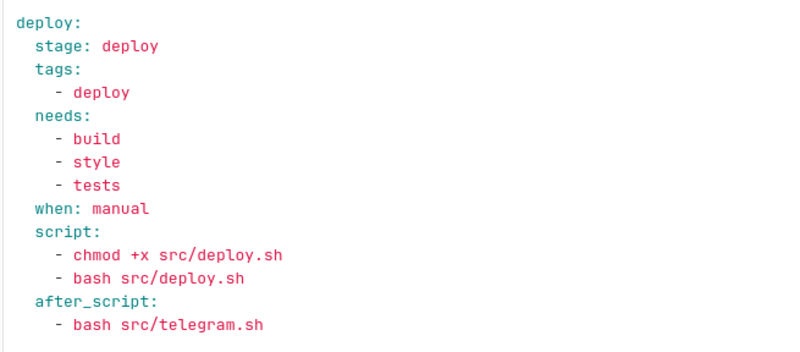
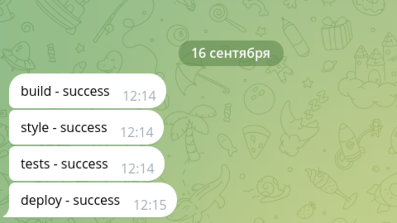

## Part 1. Настройка gitlab-runner

- Подними виртуальную машину Ubuntu Server 22.04 LTS.

  

- Будь готов, что в конце проекта нужно будет сохранить дамп образа виртуальной машины.
- Скачай и установи на виртуальную машину gitlab-runner.
- `curl -L "https://packages.gitlab.com/install/repositories/runner/gitlab-runner/script.deb.sh" | sudo bash`

  

- Запусти gitlab-runner и зарегистрируй его для использования в текущем проекте (DO6_CICD).
- `sudo apt install gitlab-runner` `sudo gitlab-runner register`
- Для регистрации понадобятся URL и токен, которые можно получить на страничке задания на платформе.

  

- `sudo gitlab-runner run`

## Part 2. Сборка

cp ../materials/linters/.clang-format src/
- Напиши этап для CI по сборке приложений из проекта C2_SimpleBashUtils.
- В файле gitlab-ci.yml добавь этап запуска сборки через мейк файл из проекта C2.
- Файлы, полученные после сборки (артефакты), сохрани в произвольную директорию со сроком хранения 30 дней.

  

## Part 3. Тест кодстайла

- Напиши этап для CI, который запускает скрипт кодстайла (clang-format).
- Если кодстайл не прошел, то «зафейли» пайплайн.
- В пайплайне отобрази вывод утилиты clang-format.

  

## Part 4. Интеграционные тесты

- Напиши этап для CI, который запускает твои интеграционные тесты из того же проекта.
- Запусти этот этап автоматически только при условии, если сборка и тест кодстайла прошли успешно.
- Если тесты не прошли, то «зафейли» пайплайн.
- В пайплайне отобрази вывод, что интеграционные тесты успешно прошли / провалились.

  

## Part 5. Этап деплоя

- Подними вторую виртуальную машину Ubuntu Server 22.04 LTS.
- Напиши этап для CD, который «разворачивает» проект на другой виртуальной машине.
- Запусти этот этап вручную, при условии, что все предыдущие этапы прошли успешно.
- Напиши bash-скрипт, который при помощи ssh и scp копирует файлы, полученные после сборки (артефакты), в директорию /usr/local/bin второй виртуальной машины.
- В файле gitlab-ci.yml добавь этап запуска написанного скрипта.
- В результате ты должен получить готовые к работе приложения из проекта C2_SimpleBashUtils (s21_cat и s21_grep) на второй виртуальной машине.
- Не забудь запустить пайплайн с последним коммитом в репозитории.

  
  
  

## Part 6. Дополнительно. Уведомления

- Настрой уведомления об успешном/неуспешном выполнении пайплайна через бота с именем «[твой nickname] DO6 CI/CD» в Telegram.
- Текст уведомления должен содержать информацию об успешности прохождения как этапа CI, так и этапа CD.
- В остальном текст уведомления может быть произвольным.

  